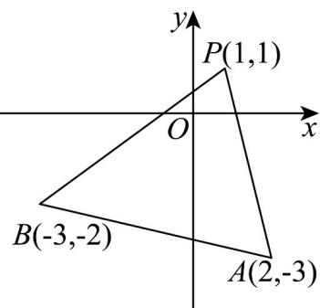

> [!faq]- 《专题05_直线的倾斜角与斜率高频题型精准突破_六大题型__高效培优期末》官方解析
>
> > [!success]- **【答案】** A
>
> > [!note]- **【分析】**
> > 结合斜率公式和图象确定正确答案·
>
> > [!note]- **【解析】**
> > 如图所示：由题意得，所求直线 $l$ 的斜率 $k$ 满足 $k \leq k_{PB}$ 或 $k \leq k_{PA}$
> >
> > 即 $k\quad \frac{1 + 2}{1 + 3} = \frac{3}{4}$ ，或 $k\leq \frac{1 + 3}{1 - 2} = -4$ ，∴ $k\quad \frac{3}{4}$ ，或 $k\leq -4$
> >
> > 即直线的斜率的取值范围是 $k = \frac{3}{4}$ 或 $k \leq -4$
> >
> > 故选：A
> >
> > 
