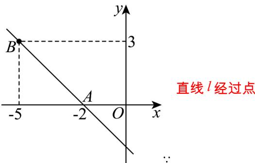

> [!faq]- 《专题05_直线的倾斜角与斜率高频题型精准突破_六大题型__高效培优期末》官方解析
>
> > [!success]- **【答案】** B
>
> > [!note]- **【分析】**
> > 先根据已知两点求出直线斜率，再利用斜率结合各选项中条件逐一判定选项.
>
> > [!note]- **【解析】**
> > 
> >
> > ∴ 直线 l 的斜率为 $k_{AB} = \frac{3 - 0}{-5 + 2} = -1$
> >
> > 选项 A：直线 l 的方程为 $y = -1(x + 2)$ ，一般式为 $x + y + 2 = 0$ ，故 A 错误；
> >
> > 选项 B：∵ 直线 l 的倾角 $\alpha\in(0,\pi]$ ， $\tan\alpha=k_{AB}=-1$ ，∴ 倾斜角 $\alpha$ 为 $\frac{3}{4}\pi$ ，故 B 正确；
> >
> > 选项 C、D：∵ $k_{AB} = -1$ ，∴ 方向向量为 $(\lambda, -\lambda)$ ，法向量为 $(\lambda, \lambda)$ ，其中 $\lambda \neq 0$ ，
> >
> > $\because (1,1)$ 与 $(\lambda , - \lambda)$ 不平行， $\therefore (1,1)$ 不是直线 $l$ 的方向向量，故C错误；
> >
> > $\because (-1,1)$ 与 $(\lambda , - \lambda)$ 的数量积为 $-\lambda -\lambda = -2\lambda \neq 0$ ，故 $(-1,1)$ 不是直线 $l$ 的法向量，故D错误.
> >
> > 故选 **B**.
