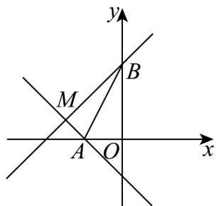

> [!faq]- 《专题05_直线的倾斜角与斜率高频题型精准突破_六大题型__高效培优期末》官方解析
>
> > [!success]- **【答案】** D
>
> > [!note]- **【分析】**
> > 根据两点间的距离公式，以及直线过定点的判定方法，求出直线所过定点，判断满足题目条件的直线情况，进而求出斜率的取值范围，再求出倾斜角范围即可·
>
> > [!note]- **【解析】**
> > 由题意得直线方程为 $2x - 2ay + 3 + a = 0$ ，变形为 $a(1 - 2y) + (2x + 3) = 0$
> >
> > 可知直线 $l$ 过定点 $M\left(-\frac{3}{2}, \frac{1}{2}\right)$
> >
> > 由 $A(-1,0), B(0,2)$ 可知 $\left|AB\right| = \sqrt{1^2 + 2^2} = \sqrt{5}$
> >
> > 当直线 $l$ 上存在点 $P$ 满足 $\left|PA\right| + \left|PB\right| = \sqrt{5}$ 时，即直线 $l$ 与线段 $AB$ 有交点，
> >
> > 
> >
> > 如图所示， $k_{MA}=\frac{\frac{1}{2}}{-\frac{3}{2}+1}=-1,k_{MB}=\frac{\frac{1}{2}-2}{-\frac{3}{2}}=1$
> >
> > 又因为直线 $2x - 2ay + 3 + a = 0$ 的斜率不为 0，
> >
> > 所以直线斜率在 $\left[-1,0\right)\cup\left(0,1\right]$ ，
> >
> > 直线倾斜角的范围为 $\left(0,\frac{\pi}{4}\right]\cup\left[\frac{3\pi}{4},\pi\right)$
> >
> > 故选 **D**.
