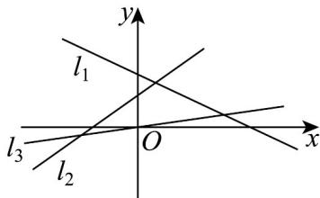

> [!faq]- 《专题05_直线的倾斜角与斜率高频题型精准突破_六大题型__高效培优期末》官方解析
>
> > [!success]- **【答案】** D
>
> > [!note]- **【分析】**
> > 利用倾斜角的大小，结合正切函数的单调性可作出判断·
>
> > [!note]- **【解析】**
> > 设直线 $l_{1}$ ， $l_{2}$ ， $l_{3}$ 的倾斜角分别为 $\alpha_{1}$ ， $\alpha_{2}$ ， $\alpha_{3}$
> >
> > 
> >
> > 则根据图象可得： $0 < \alpha_{3} < \alpha_{2} < \frac{\pi}{2} < \alpha_{1}$
> >
> > 再由正切函数的单调性可知： $\tan \alpha_{1} < 0 < \tan \alpha_{3} < \tan \alpha_{2}$
> >
> > 即有 $k_{1} < k_{3} < k_{2}$
> >
> > 故选：D.
> >
> > ## 考点02 已知斜率求参数
