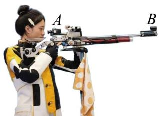
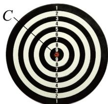

> [!faq]- 《专题05_直线的倾斜角与斜率高频题型精准突破_六大题型__高效培优期末》官方解析
>
> > [!success]- **【答案】** D
>
> > [!note]- **【分析】**
> > 根据两点求概率即可求参；
>
> > [!note]- **【解析】**
> > 点 $A(1, y_1)$ ， $B(2, y_2)$ 在斜率为 $\sqrt{3}$ 的直线 $l$ 上，则 $\frac{y_2 - y_1}{2 - 1} = y_2 - y_1 = \sqrt{3}$ 。
> >
> > 故选：D.
> >
> > 10．台州学子黄雨婷夺得巴黎奥运会 $^{10}$ 米气步枪比赛 $^{1}$ 金 $^{1}$ 银两块奖牌后， $^{10}$ 米气步枪射击项目引起了大家的关注·在 $^{10}$ 米气步枪比赛中，瞄准目标并不是直接用眼睛对准靶心，而是通过觇孔式瞄具来实现·这种瞄具有前后两个觇孔（觇孔的中心分别记为点A,B），运动员需要确保靶纸上的黑色圆心（记为点C）与这两个觇孔的中心对齐，以达到三圆同心的状态·若某次射击达到三圆同心，且点 $A\left(0,\frac{3}{2}\right)$ ，点 $B\left(\frac{4}{5},\frac{89}{50}\right)$ ，则点C的坐标为（）
> >
> > 
> >
> > 
> >
> > A. $\left(10,\frac{9}{2}\right)$ B. (10,5) C. $\left(10,\frac{11}{2}\right)$ D. (10,6)
> >
> > 【答案】B
> >
> > 【分析】由题意 A, B, C 三点共线，结合两点式斜率公式，利用斜率相等列式求解即可
> > 【详解】由题意 A, B, C 三点共线，设 $C(10, t)$ ，因为 $A\left(0, \frac{3}{2}\right)$ ， $B\left(\frac{4}{5}, \frac{89}{50}\right)$ ，
> >
> > 所以 $k_{AB}=\frac{\frac{89}{50}-\frac{3}{2}}{\frac{4}{5}-0}=\frac{7}{20}=k_{AC}=\frac{t-\frac{3}{2}}{10-0}$ ，解得 $t=5$ ，所以 $C(10,5)$
> >
> > 故选：B
> >
> > 11. 过两点 $A(5, y)$ 、 $B(3, -1)$ 的直线的倾斜角是 $135^\circ$ ，则 $y$ 等于（ ） A. 2 B. -2 C. 3 D. -3
> >
> > 【答案】D
> >
> > 【分析】根据斜率公式可得出关于 $y$ 的等式，解之即可·
> >
> > 【详解】因为斜率 $k = \tan 135^\circ = -1$ ，所以 $k = \frac{y + 1}{5 - 3} = -1$ ，解得 $y = -3 \cdot$
> >
> > 故选 **D**.
