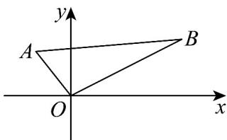

> [!faq]- 《专题05_直线的倾斜角与斜率高频题型精准突破_六大题型__高效培优期末》官方解析
>
> > [!success]- **【答案】** B
>
> > [!note]- **【分析】**
> > 根据两点斜率公式，即可结合图形，结合斜率与倾斜角的关系求解·
>
> > [!note]- **【解析】**
> > 由于 $k_{OB}=\frac{1}{2},k_{OA}=-\frac{4}{3}$ ,
> >
> > 结合图形关系可知：要使直线 l 过点 $O(0,0)$ 且与线段 AB 相交，
> >
> > 则直线 $l$ 的斜率 $k \leq -\frac{4}{3}$ 或 $k = \frac{1}{2}$ ,
> >
> > 故选：B
> >
> > 
