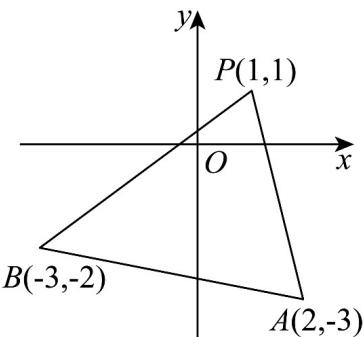

> [!faq]- 《专题05_直线的倾斜角与斜率高频题型精准突破_六大题型__高效培优期末》官方解析
>
> > [!success]- **【答案】** A
>
> > [!note]- **【分析】**
> > 画出图形，由题意得所求直线 l 的斜率 k 满足 $k \quad k_{PB}$ 或 $k \leq k_{PA}$ ，用直线的斜率公式求出 $k_{PB}$ 和 $k_{PA}$ 的值，即可求解.
>
> > [!note]- **【解析】**
> > 如图所示：由题意得，所求直线 $l$ 的斜率 $k$ 满足 $k \leq k_{PB}$ 或 $k \leq k_{PA}$
> >
> > 
> >
> > 而 $k_{PB} = \frac{-2 - 1}{-3 - 1} = \frac{3}{4}$ ， $k_{PA} = \frac{-3 - 1}{2 - 1} = -4$
> >
> > 所以 $k \frac{3}{4}$ 或 $k \leq -4$ .
> >
> > 故选：A.
> >
> > ## 考点 04 由斜率判断两直线平行关系
