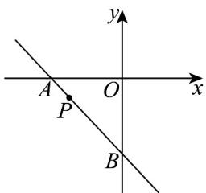

> [!faq]- 《专题06_直线方程高频题型精准突破_六大题型__高效培优期末专项训练_》官方解析
>
> > [!success]- **【答案】** B
>
> > [!note]- **【分析】**
> > 设直线 $l$ 的方程为 $\frac{x}{a} +\frac{y}{b} = 1$ ，代入点 $P$ 坐标，得到 $a,b$ 的方程，用 $a,b$ 表示出VAOB的面积，利用基本不等式即可求解·
>
> > [!note]- **【解析】**
> > 如图：
> >
> > 
> >
> > 依题意设直线 $l$ 的方程为 $\frac{x}{a} +\frac{y}{b} = 1$ （ $a <   0$ ， $b <   0$ ），则 $-\frac{5}{a} -\frac{2}{b} = 1$ ，且 $-\frac{5}{a} >0$ ， $-\frac{2}{b} >0$
> >
> > 所以 $12\sqrt{\frac{-5}{a}\cdot\frac{-2}{b}} = \frac{2\sqrt{10}}{\sqrt{ab}}$ ，即 $ab40$ ，当且仅当 $a = -10$ ， $b = -4$ 时，等号成立，
> >
> > 所以VAOB的面积 $S = \frac{1}{2} |a||b| = \frac{1}{2} ab \quad 20$ ，则VAOB面积的最小值为20.
> >
> > 故选 **B**
