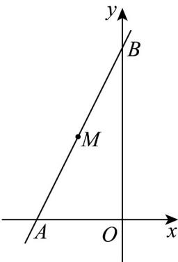

> [!faq]- 《专题06_直线方程高频题型精准突破_六大题型__高效培优期末专项训练_》官方解析
>
> > [!success]- **【答案】** 24
>
> > [!note]- **【分析】**
> > 根据题意，设直线 l 的方程为 $y - 4 = k(x + 3)$ ，分别表示出 A, B 坐标，结合三角形的面积公式代入计算，再由基本不等式即可得到结果。
>
> > [!note]- **【解析】**
> > 
> >
> > 由题意可知，直线 $l$ 的斜率存在且不为 $0$ ，设直线 $l$ 的斜率为 $k$
> >
> > 则直线 l 的方程为 $y - 4 = k(x + 3)$ ,
> >
> > 因为直线分别与 $x$ 轴的负半轴、 $y$ 轴的正半轴交于 $A$ ， $B$ 两点，所以 $k > 0$
> >
> > 令 $x = 0$ ，则 $y = 3k + 4$ ，即 $B(0,3k + 4)$
> >
> > 令 $y = 0$ ，则 $x = -3 - \frac{4}{k}$ ，即 $A\left(-3 - \frac{4}{k},0\right)$
> >
> > 所以 $S_{\triangle AOB} = \frac{1}{2}\left|OA\right|\cdot \left|OB\right| = \frac{1}{2}\left(3 + \frac{4}{k}\right)\left(3k + 4\right) = \frac{1}{2}\left(9k + \frac{16}{k} +24\right)$
> >
> > 其中 $9k + \frac{16}{k} 2\sqrt{9k \cdot \frac{16}{k}} = 24$ ，当且仅当 $9k = \frac{16}{k}$ 时，即 $k = \frac{4}{3}$ 时，等号成立，
> >
> > 所以 $S_{\triangle AOB}$ $\frac{1}{2}(24+24)=24$ ，即 VAOB 面积最小值为 24.
> >
> > 故答案为：24
> >
> > ## 考点03 直线截距式考点
