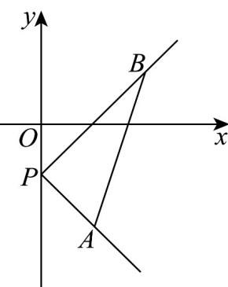

> [!faq]- 《专题06_直线方程高频题型精准突破_六大题型__高效培优期末专项训练_》官方解析
>
> > [!success]- **【答案】** D
>
> > [!note]- **【分析】**
> > 先由直线 l 的方程得到直线过定点 $P(0,-1)$ ，再由直线 l 与线段 AB 有交点得直线的斜率变化范围，进而可得直线倾斜角的范围。
>
> > [!note]- **【解析】**
> > 由直线 $l:m(x+y+1)+n(2x-y-1)=0, m\in\mathbb{R}, n\in\mathbb{R}$ 令 $\left\{\begin{aligned}x+y+1&=0\\ 2x-y-1&=0\end{aligned}\right.$ ，解得 $\left\{\begin{aligned}x&=0\\ y&=-1\end{aligned}\right.$ ，所以直线 l 经过定点 $P(0,-1)$ .
> > 由 $A(1,-2), B(2,1)$ ，则 $k_{PA}=\frac{-1-(-2)}{0-1}=-1$ ， $k_{PB}=\frac{1-(-1)}{2-0}=1$ ，
> > 要使直线 l 与连接 $A(1,-2), B(2,1)$ 两点的线段总有公共点，
> > 则直线 l 的斜率 k 需满足 $-1 \leq k \leq 1$ 则直线 l 的倾斜角范围为 $\left[0,\frac{\pi}{4}\right]\cup\left[\frac{3\pi}{4},\pi\right)$ .
> >
> > 
> >
> > 故选 **D**.
