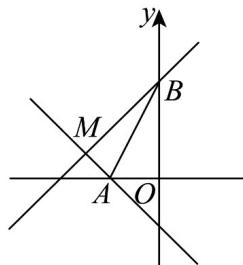

> [!faq]- 《专题06_直线方程高频题型精准突破_六大题型__高效培优期末专项训练_》官方解析
>
> > [!success]- **【答案】** D
>
> > [!note]- **【分析】**
> > 首先确定直线 $l$ 所过定点，根据线段 $\left|AB\right|$ 长度，可将问题转化为直线 $l$ 与线段 $AB$ 有交点，结合图象确定临界状态，得到直线 $l$ 斜率的取值范围，进而求得结果·
>
> > [!note]- **【解析】**
> > 直线 $l$ 方程可化为： $(1 - 2y)a + (2x + 3) = 0$
> >
> > 令 $\left\{ \begin{array}{l} 1 - 2y = 0 \\ 2x + 3 = 0 \end{array} \right.$ 得： $\left\{ \begin{array}{ll} x = -\frac{3}{2} & \\ y = \frac{1}{2} & \text{直线 恒过定点} \\ & \therefore l \end{array} \right.$ $M\left(-\frac{3}{2}, \frac{1}{2}\right)$ ，
> >
> > 由 $A(-1,0), B(0,2)$ 得： $|AB| = \sqrt{1^2 + 2^2} = \sqrt{5}$
> >
> > 当直线 $l$ 上存在点 $P$ 满足 $\left|PA\right| + \left|PB\right| = \sqrt{5}$ 时，直线 $l$ 与线段 $AB$ 有交点，如图所示，
> >
> > 
> >
> > $$
> > k _ {M A} = \frac {\frac {1}{2}}{- \frac {3}{2} + 1} = - 1, k _ {M B} = \frac {\frac {1}{2} - 2}{- \frac {3}{2}} = 1
> > $$
> >
> > ∴ 直线 l 的斜率 $k=\frac{1}{a}\in[-1,0)\cup(0,1]$
> >
> > $$
> > \therefore a \in (- \infty , - 1 ] \cup [ 1, + \infty)
> > $$
> >
> > 故选 **D**.
