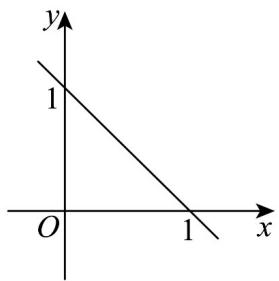
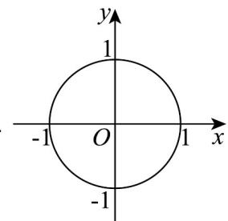

<!-- question-source:start -->
25. 关于 $x, y$ 的方程 $x^n + y^n = 1(n \in \mathbf{Z})$ 对应的曲线不可能是（）

A

B

C

<!-- question-source:end -->

![[高中/课堂同步/题库/人教A版高中数学同步讲义(2026)/04_选择性必修第二册/期末/专项训练/专题08_圆的两类高频题型精准突破_九大题型__高效培优期末专项训练_/_compact/answers/Q00060755A1.md]]
