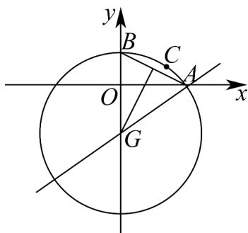

> [!faq]- 《专题08_圆的两类高频题型精准突破_九大题型__高效培优期末专项训练_》官方解析
>
> > [!success]- **【答案】** (1)2x-y-5=0； (2) $x^{2}+\left(y+3\right)^{2}=25$ .
>
> > [!note]- **【分析】**
> > （1）先求出直线 $AB$ 的斜率，再求出 $AB$ 上的高所在直线 $l$ 的斜率，结合过点 $C$ ，写出点斜式，整理为一般式即可；
> >
> > (2) 根据直线 $AB$ 的斜率，求出 $AB$ 的中垂线斜率，结合 $AB$ 的中点，得到 $AB$ 的中垂线方程，其与直线 $2x - 3y - 9 = 0$ 的交点即为圆心 $G$ ， $GA$ 即为半径，根据圆心半径写出圆 $G$ 的标准方程即可.
>
> > [!note]- **【解析】**
> > （1）由已知得，直线 $AB$ 的斜率为 $k_{AB} = \frac{2 - 0}{0 - 4} = -\frac{1}{2}$ ，所以 $AB$ 上的高所在直线 $l$ 的斜率为2，又点 $C(3,1)$ ，所以 $AB$ 上的高所在直线 $l$ 的方程为 $y - 1 = 2(x - 3)$ ，即 $2x - y - 5 = 0$ 。
> >
> > (2) 因为 AB 的中点为 $(2,1)$ ，直线 $AB$ 斜率为 $-\frac{1}{2}$ ，则 AB 的中垂线斜率为 2，
> >
> > 故 $AB$ 的中垂线方程为，即 $y = 2x - 3$ ，由 $\left\{ \begin{array}{l} y = 2x - 3 \\ 2x - 3y - 9 = 0 \end{array} \right.$ ，解得圆心 $G(0, -3)$ ，则圆 $G$ 的半径 $r = |GA| = 5$ ，故圆 $G$ 的标准方程为 $x^{2} + (y + 3)^{2} = 25$ ：
> >
> > 
