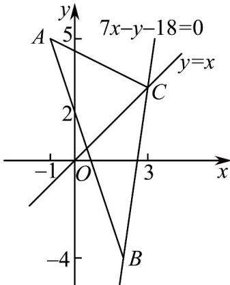

> [!faq]- 《专题08_圆的两类高频题型精准突破_九大题型__高效培优期末专项训练_》官方解析
>
> > [!success]- **【答案】** (1) $B(2,-4),C(3,3)$ ; (2) $(x+1)^{2}+y^{2}=25$ .
>
> > [!note]- **【分析】**
> > （1）利用点 C 在直线 7x - y - 18 = 0 上，也在直线 y = x 上，联立方程求得点 C；利用 B 在直线 y = x 上，边 AB 的中点在直线 7x - y - 18 = 0 上，联立方程求得点 B；
> >
> > (2) 根据三个顶点在圆上利用待定系数法求外接圆的方程.
>
> > [!note]- **【解析】**
> > （1）依题意，点 $C$ 在直线 $7x - y - 18 = 0$ 上，也在直线 $y = x$ 上，故联立方程组 $\left\{ \begin{array}{l}7x - y - 18 = 0\\ y = x \end{array} \right.$ ，解得 $\left\{ \begin{array}{l}x = 3\\ y = 3 \end{array} \right.$ ，即点 $C(3,3)$ ，设点 $B(s,t)$ ，则三角形边 $AB$ 的中点坐标为 $\left(\frac{s - 1}{2},\frac{t + 5}{2}\right)$ 故可得 $\left\{ \begin{array}{l}\frac{s - 1}{2} = \frac{t + 5}{2}\\ 7s - t - 18 = 0 \end{array} \right.$ ，解得 $\left\{ \begin{array}{l}s = 2\\ t = -4 \end{array} \right.$ ，即点 $B(2, - 4)$
> >
> > 
> >
> > (2) 设 VABC 的外接圆方程为 $(x-a)^{2}+(y-b)^{2}=r^{2}(r>0)$
> >
> > 将三角形三个顶点的坐标代入，
> >
> > 得： $\left\{\begin{aligned}&\left(-1-a\right)^{2}+\left(5-b\right)^{2}=r^{2}\\ &\left(2-a\right)^{2}+\left(-4-b\right)^{2}=r^{2}\\ &\left(3-a\right)^{2}+\left(3-b\right)^{2}=r^{2}\end{aligned}\right.$ ，解得 $\left\{\begin{aligned}a&=-1\\ b&=0\\ r&=5\end{aligned}\right.$
> >
> > 所以三角形外接圆的方程为 $(x+1)^{2}+y^{2}=25$ .
