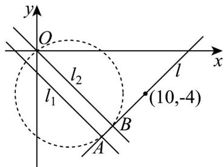

> [!faq]- 《专题08_圆的两类高频题型精准突破_九大题型__高效培优期末专项训练_》官方解析
>
> > [!success]- **【答案】** (1) x - y - 14 = 0 ; (2) $x^{2}+y^{2}-6x+8y=0$ （或 $(x-3)^{2}+(y+4)^{2}=25$ ）；
>
> > [!note]- **【分析】**
> > （ $^{1}$ ）利用直线垂直可求得斜率为 k=1 ，由点斜式方程可得结果；
> >
> > (2) 分别求出两直线交点坐标，设出圆的一般方程代入计算即可求得圆的方程.
>
> > [!note]- **【解析】**
> > （1）由题意可得 $l_{1}:x+y+2=0$ 的斜率为-1，
> >
> > 可得直线 l 的斜率为 k = 1 ，由点斜式方程可得 $y + 4 = x - 10$
> >
> > 即直线 l:x-y-14=0 ;
> >
> > (2) 联立直线 l 和 $l_{1}$ 方程 $\left\{\begin{aligned} x-y-14&=0 \\ x+y+2&=0 \end{aligned}\right.$ ，解得 $A(6,-8)$ ;
> >
> > 联立直线 l 和 $l_{2}$ 方程 $\left\{\begin{aligned}x-y-14&=0\\ x+y&=0\end{aligned}\right.$ ，解得 $B(7,-7)$ ;
> >
> > 如下图所示：
> >
> > 
> >
> > 设过三点 $A, B, O$ 的圆的方程为 $x^{2} + y^{2} + Dx + Ey + F = 0$
> >
> > 将三点坐标代入可得 $\left\{ \begin{array}{l}36 + 64 + 6D - 8E + F = 0\\ 49 + 49 + 7D - 7E + F = 0\\ F = 0 \end{array} \right.$ ，解得 $\left\{ \begin{array}{l}D = -6\\ E = 8\\ F = 0 \end{array} \right.$
> >
> > 可得圆的方程为 $x^{2} + y^{2} - 6x + 8y = 0$ （或 $(x - 3)^{2} + (y + 4)^{2} = 25$ ）.
