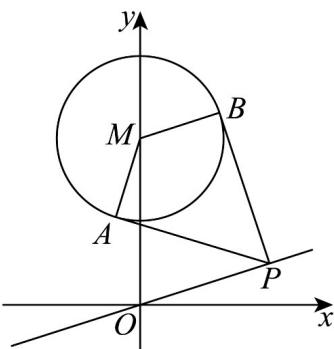

> [!faq]- 《专题08_圆的两类高频题型精准突破_九大题型__高效培优期末专项训练_》官方解析
>
> > [!success]- **【答案】** $(1)(0,0)$ 和 $\left(\frac{6}{5},\frac{2}{5}\right)$ ; $(2)(0,2)$ 和 $\left(\frac{3}{5},\frac{1}{5}\right)$
>
> > [!note]- **【分析】**
> > （1）设 $P(3m,m)$ ，连接 $MP$ ，分析易得 $MP = 2MA = 2$ ，即有 $(3m)^2 + (m - 2)^2 = 4$ ，解得 $m$ 的值，即可得到答案：
> >
> > (2) 根据题意，分析可得：过 A, P, M 三点的圆为以 MP 为直径的圆，设 P 的坐标为
> >
> > $(3m,m)$ ，用 $m$ 表示过 $A, P$ ， $M$ 三点的圆为 $x^{2} + y^{2} - 2y - m(3x + y - 2) = 0$ ，结合直线与圆的位置关系，分析可得答案：
>
> > [!note]- **【解析】**
> > （1）根据题意，点 $P$ 在直线 $l$ 上，
> >
> > 
> >
> > 设 $P(3m,m)$ ，连接 MP，
> >
> > 因为圆 M 的方程为 $x^{2} + y^{2} - 4y + 3 = 0 \Rightarrow x^{2} + (y - 2)^{2} = 1$
> >
> > 所以圆心 $M(0,2)$ ，半径 $r = 1$
> >
> > 因为过点 P 作圆 M 的切线 PA，PB，切点为 A，B；
> >
> > 则有 $PA \perp MA, PB \perp MB$ ，且 $MA = MB = r = 1$
> >
> > 易得 $\Delta APM\cong \Delta BPM$
> >
> > 又由 $\angle APB = 60^{\circ}$ ，即 $\angle APM = 30^{\circ}$
> >
> > 则 $MP = 2MA = 2$ ，即有 $\left(3m\right)^2 +\left(m - 2\right)^2 = 4$
> >
> > 解得 $m = 0$ 或 $m = \frac{2}{5}$ ，即 $P$ 的坐标为 $(0,0)$ 和 $\left(\frac{6}{5},\frac{2}{5}\right)$
> >
> > (2) 根据题意，PA 是圆 M 的切线，则 $PA \perp MA$
> >
> > 则过 $A, P, M$ 三点的圆为以 $MP$ 为直径的圆，
> >
> > 设 $P$ 的坐标为 $(3m,m)$ ， $M(0,2)$
> >
> > 则以 $MP$ 为直径的圆为 $(x - 0)(x - 3m) + (y - m)(y - 2) = 0$
> >
> > 变形可得： $x^{2} + y^{2} - 3mx - (m + 2)y + 2m = 0$
> >
> > 即 $x^{2} + y^{2} - 2y - m(3x + y - 2) = 0$
> >
> > 则有 $\left\{\begin{aligned}x^{2}+y^{2}-2y=0\\ 3x+y-2=0\end{aligned}\right.$ ，解得 $\left\{\begin{aligned}x=0\\ y=2\end{aligned}\right.$ 或 $\left\{\begin{aligned}x=\frac{3}{5}\\ y=\frac{1}{5}\end{aligned}\right.$
> >
> > 则当 $x = 0, y = 2$ 和 $x = \frac{3}{5}$ ， $y = \frac{1}{5}$ 时， $x^2 + y^2 - 2y - m(3x + y - 2) = 0$ 恒成立，
> >
> > 则经过 $A, P, M$ 三点的圆必经过异于 $M$ 的某个定点，
> >
> > 且定点的坐标 $(0,2)$ 和 $\left(\frac{3}{5},\frac{1}{5}\right)$ .
