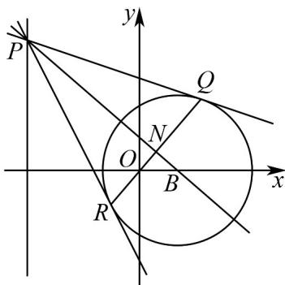

> [!faq]- 《专题08_圆的两类高频题型精准突破_九大题型__高效培优期末专项训练_》官方解析
>
> > [!success]- **【答案】** (1) $(x-1)^{2}+y^{2}=4$ (2) (i) 证明见解析，过定点 $(0,0)$ ；(ii) 存在， $P(-3,4)$ ，最大值为 $1$
>
> > [!note]- **【分析】**
> > （1）设 $M(x,y)$ ，由两点间距离公式将几何关系 $\left|MO\right| = \frac{1}{2}\left|MA\right|$ 转为代数运算并化简即可求解；（2）（i）先设 $Q(x_1,y_1),R(x_2,y_2)$ ，利用圆的切线性质（圆心与切点的连线垂直于切线），推导出切线 $PQ$ 、 $PR$ 的方程，再将动点 $P$ 的坐标代入切线方程，得到 $Q$ 、 $R$ 满足的直线方程 $4x - py = 0$ ，从而确定直线 $QR$ 的方程，最后判断其过定点 $(0,0)$ ；
> >
> > （ii）先根据切线相关性质（结合几何关系或向量垂直等）确定 $N$ 的位置特征，再得出 $N$ 在以 $OB$ 为直径的圆上运动，结合 $\triangle ABN$ 的底 $|AB|$ 固定，通过分析高的最大值情况，利用直线斜率关系求出 $p$ 的值，进而确定点 $P$ 坐标和面积最大值.
>
> > [!note]- **【解析】**
> > （1）设 $M(x,y)$ ，由题 $\left|MO\right| = \frac{1}{2}\left|MA\right|\Leftrightarrow 4\left(x^2 +y^2\right) = (x + 3)^2 +y^2$
> >
> > 整理得 $x^{2} + y^{2} - 2x - 3 = 0$ ，即 $(x - 1)^{2} + y^{2} = 4$
> >
> > (2) (i) 设 $Q(x_{1}, y_{1})$ ， $R(x_{2}, y_{2})$ ，易知 $B$ 为曲线 $C$ 的圆心，由 $PQ$ 与圆相切，可得直线 $PQ$ 的法向量为 $\overline{B} Q = (x_{1} - 1, y_{1})$ ，因此 $PQ$ 的方程为 $\left(x_{1} - 1\right)\left(x - x_{1}\right) + y_{1}\left(y - y_{1}\right) = 0$
> >
> > 
> >
> > 整理得 $\left(x_{1} - 1\right)x + y_{1}y + x_{1} = x_{1}^{2} + y_{1}^{2}$ ，由 $Q$ 在圆 $C$ 上得 $x_{1}^{2} + y_{1}^{2} = 2x_{1} + 3$
> >
> > 因此 $PQ$ 的方程为 $\left(x_{1} - 1\right)\left(x - 1\right) + y_{1}y = 4$
> >
> > 同理可得 $PR$ 的方程为 $\left(x_{2} - 1\right)\left(x - 1\right) + y_{2}y = 4$
> >
> > 由两切线交于 $P$ 点，可得 $\left\{ \begin{array}{l} -4x_{1} + py_{1} = 0 \\ -4x_{2} + py_{2} = 0 \end{array} \right.$ ，这说明 $Q$ ， $R$ 在直线 $4x - py = 0$ 上，
> >
> > 因此直线 QR 的方程为 4x - py = 0 ，直线 QR 过定点 $O(0,0)$ ；
> >
> > (ii) 由 $PQ$ ， $PR$ 是圆的切线可得 $PB \perp QR$ ，因此 $N$ 为 $QR$ 的中点，
> >
> > 由 $BN \perp NO$ 可得， $N$ 在以 $OB$ 为直径的圆上运动，该圆的圆心为 $T\left(\frac{1}{2}, 0\right)$ ， $r = \frac{1}{2}$
> >
> > 当 $N$ 位于点 $\left(\frac{1}{2},\frac{1}{2}\right)$ 时， $\triangle ABN$ 的面积最大，为 $S = \frac{1}{2}|AB| \cdot r = 1$
> >
> > 此时 $k_{BN} = -1$ ，故 $k_{RQ} = 1$ ，即 $\frac{4}{p} = 1 \Rightarrow p = 4$
> >
> > 因此存在 $P(-3,4)$ 使得 $\triangle ABN$ 面积最大，最大值为 1.
