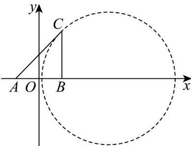

> [!faq]- 《专题08_圆的两类高频题型精准突破_九大题型__高效培优期末专项训练_》官方解析
>
> > [!success]- **【答案】** D
>
> > [!note]- **【分析】**
> > 根据给定条件，利用目标函数的几何意义，结合圆上的点与定点距离的最大值求解即可.
>
> > [!note]- **【解析】**
> > 圆 $(x-2)^{2}+y^{2}=1$ 的圆心 $C(2,0)$ ，半径r=1，
> >
> > 目标函数 $(x + 1)^2 +(y - 4)^2$ 表示圆 $C$ 上的点 $P$ 与定点 $A(-1,4)$ 距离的平方，
> >
> > 而 $|PA|_{\max}=|PC|+r=\sqrt{(-1-2)^{2}+(4-0)^{2}}+1=6$
> >
> > 所以 $(x + 1)^2 +(y - 4)^2$ 的最大值为36.
> >
> > 故选：D
> >
> > 49. 阿波罗尼斯（约公元前 $262 - 190$ 年）证明过这样一个命题：平面内到两定点距离之比为常数 $k(k > 0, k \neq 1)$ 的点的轨迹是圆，后人将这个圆称为阿氏圆·已知在VABC中， $AB = 2, AC = \sqrt{2} BC$ ，则VABC的面积最大值为\_\_\_\_。
> >
> > 【答案】 $2 \sqrt{2}$
> >
> > 【分析】构建如下图示的直角坐标系，令 $A(-1,0), B(1,0), C(x,y)$ ，应用两点距离公式求 $C$ 的轨迹，数形结合确定三角形面积最大值·
> >
> > 【详解】由题设，构建如下图示的直角坐标系，令 $A(-1,0), B(1,0), C(x,y)$
> >
> > 由 $AC = \sqrt{2} BC$ ，则 $(x + 1)^2 +y^2 = 2(x - 1)^2 +2y^2$
> >
> > 所以 $(x - 3)^2 + y^2 = 8$ ，故 $C$ 在以 $(3,0)$ 为圆心， $2\sqrt{2}$ 为半径的圆上，
> >
> > 
> >
> > 所以VABC的面积最大值为 $\frac{1}{2}\times2\sqrt{2}\times2=2\sqrt{2}$ .
> >
> > 故答案为： $2\sqrt{2}$
