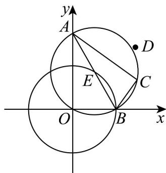

> [!faq]- 《专题08_圆的两类高频题型精准突破_九大题型__高效培优期末专项训练_》官方解析
>
> > [!success]- **【答案】** $4 \sqrt{2}$
>
> > [!note]- **【分析】**
> > 先求得 A, B 两点坐标，根据 $\left|AB\right|=2\sqrt{2}$ 得到 $\left(-\frac{m}{k}\right)^{2}+m^{2}=8$ ，再结合 $CA \perp CB$ 可得到 C 轨迹为动圆，求得该动圆圆心的方程，即可求得答案：
>
> > [!note]- **【解析】**
> > 由 $y = kx + m (k \neq 0)$ ，得 $A\left(-\frac{m}{k}, 0\right), B(0, m)$
> >
> > 由 $|AB|=2\sqrt{2}$ ，得 $\left(-\frac{m}{k}\right)^{2}+m^{2}=8$
> >
> > 由 $CA \perp CB$ ，得 $AC \cdot BC = 0$
> >
> > 设 $C(x,y)$ ，则 $\left(x + \frac{m}{k},y\right)\cdot (x,y - m) = 0$
> >
> > 即 $\left(x+\frac{m}{2k}\right)^{2}+\left(y-\frac{m}{2}\right)^{2}=\frac{m^{2}}{4k^{2}}+\frac{m^{2}}{4}=2$ ，
> >
> > 因此点 C 的轨迹为一动圆，
> >
> > 设该动圆圆心为 $E\left(x^{\prime},y^{\prime}\right)$ ，即有 $x^{\prime} = -\frac{m}{2k},y^{\prime} = \frac{m}{2}$
> >
> > 则 $\frac{m}{k} = -2x', m = 2y'$ 代入 $\left(-\frac{m}{k}\right)^2 + m^2 = 8$ ，整理得： $x'^2 + y'^2 = 2$ ，
> >
> > 即 C 轨迹的圆心在圆 $x'^{2} + y'^{2} = 2$ 上（除此圆与坐标轴的交点外），
> >
> > 则 $\left|CD\right|\leq\left|DE\right|+\sqrt{2}\leq\left|DO\right|+\sqrt{2}+\sqrt{2}$
> >
> > 当且仅当点 C 为射线 DE 与圆 $\left(x+\frac{m}{2k}\right)^{2}+\left(y-\frac{m}{2}\right)^{2}=2$ 的交点，点 E 为射线 DO 与圆 $x^{\prime2}+y^{\prime2}=2$ 的交点时等号成立，
> >
> > 又 $|DO|=\sqrt{(2-0)^{2}+(2-0)^{2}}=2\sqrt{2}$
> >
> > 所以点 C 到点 $D(2,2)$ 的距离的最大值为 $2\sqrt{2} + 2\sqrt{2} = 4\sqrt{2}$ .
> >
> > 
> >
> > 故答案为： $4\sqrt{2}$
> >
> > 考点06 圆中参数范围问题
