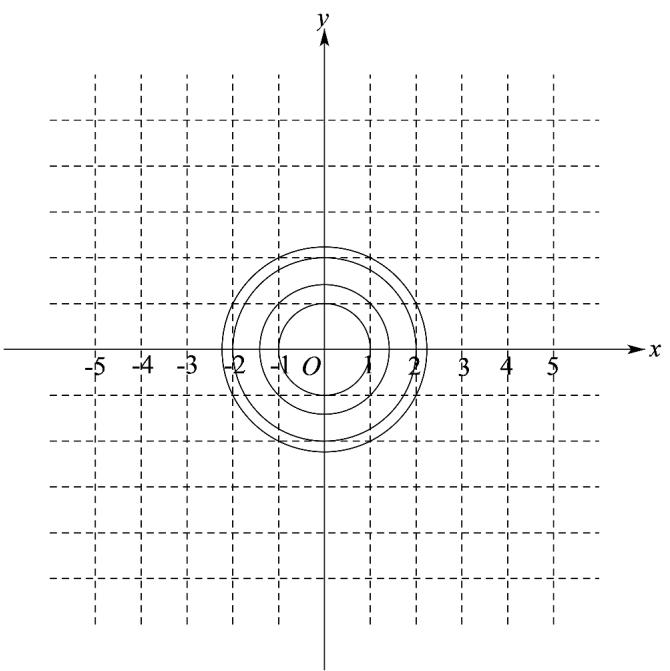
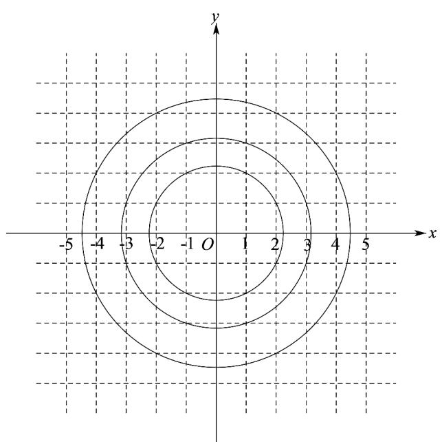
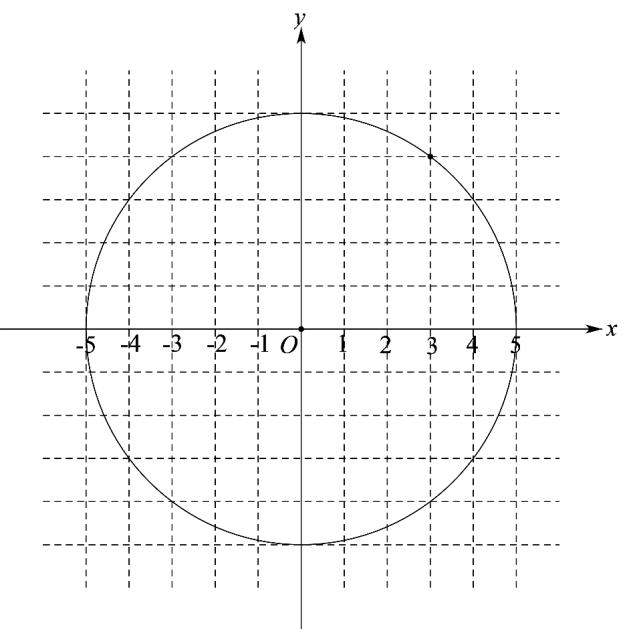

> [!faq]- 《专题08_圆的两类高频题型精准突破_九大题型__高效培优期末专项训练_》官方解析
>
> > [!success]- **【答案】** 12
>
> > [!note]- **【分析】**
> > 将问题转化为以 $(0,0)$ 为圆心， $d$ 为半径的圆上的整点个数的求解，采用数形结合的方式可确定结果·
>
> > [!note]- **【解析】**
> > 设 $P(a,b)(a\in\mathbf{Z},b\in\mathbf{Z})$ ，整点 $Q(a+x,b+y)(x\in\mathbf{Z},y\in\mathbf{Z})$
> >
> > $$
> > \therefore | P Q | = \sqrt {x ^ {2} + y ^ {2}} = d,
> > $$
> >
> > $\therefore (x, y)$ 轨迹是如图所示的以 $(0, 0)$ 为圆心， $d$ 为半径的圆上的整点，
> >
> > $\because 0 < k_{1} < k_{2} < k_{3}$ ， $\therefore k_{1} = 4$ ，如下图所示，
> >
> > 
> >
> > $k_{2} = 8$ ，如下图所示，
> >
> > 
> >
> > $k_{3}=12$ ，如下图所示，
> >
> > <!-- source-part:2 pages:51-51 -->
> >
> > 
> >
> > 故答案为：12·
> >
> > 60. 过点 $P(1,1)$ 可以向圆 $x^{2} + y^{2} + 2x - 4y + k - 2 = 0$ 引两条切线，则 $k$ 的范围
> >
> > 【答案】(2,7)
> >
> > 【分析】根据方程表示圆和点 P 在圆外可得不等式，由此可解得 k 的范围·
> >
> > 【详解】由 $x^{2} + y^{2} + 2x - 4y + k - 2 = 0$ 表示圆可得： $4 + 16 - 4(k - 2) > 0$ ，解得： $k <   7$
> >
> > ∵ 过 P 可作圆的两条切线，∴ P 在圆外，∴ $1^{2} + 1^{2} + 2 - 4 + k - 2 > 0$ ，解得：k > 2；
> >
> > 综上所述：k 的范围为 $(2,7)$ .
> >
> > 故答案为：(2,7).
