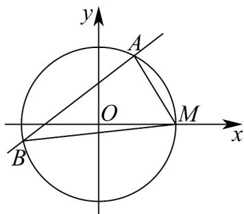

> [!faq]- 《专题09_直线与圆及圆与圆的位置关系高频题型精准突破_九大题型__高效》官方解析
>
> > [!success]- **【答案】** (1)证明见解析 (2) ① $x \pm \sqrt{3} y + 1 = 0$ ；②证明见解析
>
> > [!note]- **【分析】**
> > （ $^{1}$ ）利用直线过定点且定点在圆内部，可证明直线与圆必有两个交点；
> >
> > (2) ①利用圆心距来求弦长，即可由点到直线的距离公式求解直线方程；
> >
> > ②利用分类讨论斜率是否存在，然后设直线方程与圆联立方程组，利用根与系数关系来求解定值即可·
>
> > [!note]- **【解析】**
> > （1）原方程可化为 $(x + 1)m + y = 0$ ，令 $\left\{ \begin{array}{l}x + 1 = 0\\ y = 0 \end{array} \right.$
> >
> > 解得：定点 $P(-1,0)$ ， $d = |OP| = 1 < 2$
> >
> > 所以定点 P 在圆内，所以直线与圆相交；
> >
> > (2) ①由圆心原点到直线 l 的距离 $d = \frac{|m|}{\sqrt{m^{2} + 1}}$
> >
> > 结合弦长公式： $\left|AB\right|=2\sqrt{r^{2}-d^{2}}$ ，可得 $\sqrt{15}=2\sqrt{4-d^{2}}$ ，解得 $d=\frac{1}{2}$
> >
> > 所以 $d=\frac{|m|}{\sqrt{m^{2}+1}}=\frac{1}{2}$ ，解得 $m=\pm\frac{\sqrt{3}}{3}$ ，
> >
> > 即可得直线 l 方程为： $x \pm \sqrt{3}y + 1 = 0$
> > - **②**：由题意知， $M(2,0)$ ，
> >
> > 
> >
> > 当直线 l 斜率不存在时， $x_{A}=x_{B}=-1$ ， $\left(y_{A}\right)^{2}=\left(y_{B}\right)^{2}=3$
> >
> > 不妨取 $y_{A} = \sqrt{3}, y_{B} = -\sqrt{3}$
> >
> > 则 $k_{1}=\frac{\sqrt{3}-0}{-1-2}=-\frac{\sqrt{3}}{3},k_{2}=\frac{-\sqrt{3}-0}{-1-2}=\frac{\sqrt{3}}{3}$ ，此时 $k_{1}k_{2}=-\frac{\sqrt{3}}{3}\times\frac{\sqrt{3}}{3}=-\frac{1}{3}$ .
> >
> > 直线 $l$ 斜率存在时，设方程为 $y = k(x + 1)$
> >
> > 代入圆的方程 $x^{2} + y^{2} = 4$ 可得 $\left(1 + k^{2}\right)x^{2} + 2k^{2}x + k^{2} - 4 = 0$
> >
> > 设 $A(x_{1},y_{1}),B(x_{2},y_{2})$ ，则 $x_{1} + x_{2} = -\frac{2k^{2}}{1 + k^{2}},x_{1}x_{2} = \frac{k^{2} - 4}{1 + k^{2}}$
> >
> > 又 $k_{1} = \frac{y_{1} - 0}{x_{1} - 2} = \frac{k(x_{1} + 1)}{x_{1} - 2}, k_{2} = \frac{y_{2} - 0}{x_{2} - 2} = \frac{k(x_{2} + 1)}{x_{2} - 2}$
> >
> > 所以 $k_{1}k_{2}=\frac{k(x_{1}+1)}{x_{1}-2}\cdot\frac{k(x_{2}+1)}{x_{2}-2}=\frac{k^{2}\left(\frac{k^{2}-4}{1+k^{2}}-\frac{2k^{2}}{1+k^{2}}+1\right)}{\frac{k^{2}-4}{1+k^{2}}-2\left(-\frac{2k^{2}}{1+k^{2}}\right)+4}=\frac{k^{2}(-3)}{9k^{2}}=-\frac{1}{3}.$
> >
> > 综上， $k_{1}k_{2}$ 为定值 $-\frac{1}{3}$
