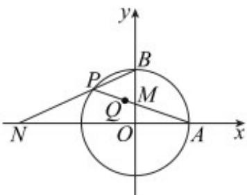

> [!faq]- 《专题09_直线与圆及圆与圆的位置关系高频题型精准突破_九大题型__高效》官方解析
>
> > [!success]- **【答案】** (1) $x^{2}+y^{2}-\frac{4}{3}x-\frac{4}{3}=0$ (2)证明见解析，8
>
> > [!note]- **【分析】**
> > （1）设点，根据向量运算公式可得 $\left\{ \begin{array}{ll}x_0 = \frac{3}{2} x - 1\\ y_0 = \frac{3}{2} y \end{array} \right.$ ，代入圆的方程，可得轨迹方 $Q(x,y)$ $P(x_0,y_0)$
> >
> > 程；
> >
> > (2) 根据 AP, BP 方程确定 M, N, 结合两点间距离公式化简可得证.
>
> > [!note]- **【解析】**
> > （1）由已知 $A(2,0)$ ， $B(0,2)$
> >
> > 设 $Q(x,y)$ ， $P(x_{0},y_{0})$
> >
> > 则 $\stackrel{\square\square}{A}Q=\left(x-2,y\right)$ ， $\stackrel{\square\square}{QP}=\left(x_{0}-x,y_{0}-y\right)$ ，
> >
> > 则 $\left\{\begin{aligned}x-2&=2\left(x_{0}-x\right)\\ y&=2\left(y_{0}-y\right)\end{aligned}\right.$ ，即 $\left\{\begin{aligned}x_{0}&=\frac{3}{2}x-1\\ y_{0}&=\frac{3}{2}y\end{aligned}\right.$
> >
> > 则 $\left(\frac{3}{2} x - 1\right)^2 +\left(\frac{3}{2} y\right)^2 = 4$ ，即 $x^{2} + y^{2} - \frac{4}{3} x - \frac{4}{3} = 0$
> >
> > 故点 $Q$ 的轨迹方程为 $x^{2} + y^{2} - \frac{4}{3} x - \frac{4}{3} = 0$
> >
> > (2) 设 $P(x_{0}, y_{0})$ ，则 $x_{0}^{2} + y_{0}^{2} = 4$ ，
> >
> > 直线 $_{AP}$ 方程是： $y = \frac{y_0}{x_0 - 2}(x - 2)$ ，代入 $x = 0$ ，得 $y = \frac{-2y_0}{x_0 - 2}$ ，
> >
> > 直线 $_{BP}$ 方程是 $y=\frac{y_{0}-2}{x_{0}}x+2$ ，代入y=0，得 $x=\frac{-2x_{0}}{y_{0}-2}$ ，
> >
> > $$
> > \left| A N \right| \cdot \left| B M \right| = \left| 2 - \frac {- 2 x _ {0}}{y _ {0} - 2} \right| \cdot \left| 2 - \frac {- 2 y _ {0}}{x _ {0} - 2} \right| = 4 \left| \frac {2 x _ {0} y _ {0} - 4 x _ {0} - 4 y _ {0} + 4 + x _ {0} ^ {2} + y _ {0} ^ {2}}{x _ {0} y _ {0} - 2 x _ {0} - 2 y _ {0} + 4} \right|
> > $$
> >
> > $= 4\left|\frac{2(x_0y_0 - 2x_0 - 2y_0 + 4)}{x_0y_0 - 2x_0 - 2y_0 + 4}\right| = 8$ ，即为定值·
> >
> > 
