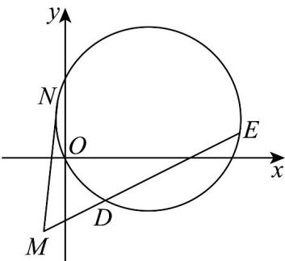

> [!faq]- 《专题09_直线与圆及圆与圆的位置关系高频题型精准突破_九大题型__高效》官方解析
>
> > [!success]- **【答案】** (1) $(x-3)^{2}+(y-1)^{2}=10$ (2) $m=\frac{2}{3}$ 或m=-2 (3) $P$ 为点 $(-2, -4)$ 时， $|DP| \cdot |EP|$ 为定值40
>
> > [!note]- **【分析】**
> > （1）设圆心坐标为 $C(a,b)$ ，由题意可得 $2a - b - 5 = 0$ ，且 $b = 4 - a$ ，可求得圆心坐标与半径，进而可求得圆的方程；
> >
> > (2) 由题意可得 $\frac{|5m|}{\sqrt{(m - 1)^2 + 1}} = \sqrt{10}$ ，求解即可；
> >
> > (3) 由题意可得直线 $l_{2}$ 经过定点 $M(-2, -4)$ ，设过 $M(-2, 4)$ 的直线与圆的切点为 $N$ ，
> >
> > 可得 $\left|MN\right|^{2}=\left|MD\right|\left|ME\right|$ ，当P为定点 $M(-2,-4)$ ，符合题意·
>
> > [!note]- **【解析】**
> > （1）设圆心坐标为 $C(a,b)$ ，因为圆心 $C$ 在直线 $l_{1}:x + y - 4 = 0$ 上，则 $b = 4 - a$ ，
> >
> > 因为利用圆经过点 $A(2,4)$ 和 $B(6,2)$ ，所以 $\sqrt{(a - 2)^2 + (b - 4)^2} = \sqrt{(a - 6)^2 + (b - 2)^2}$
> >
> > 两边平方后得 $(a-2)^{2}+(b-4)^{2}=(a-6)^{2}+(b-2)^{2}$ ，
> >
> > 整理得 $2a - b - 5 = 0$ ，又 $b = 4 - a$ ，解得 $a = 3$ ， $b = 1$ ，所以圆心为 $C(3,1)$
> >
> > 的以圆的半径 $r = \sqrt{(3 - 2)^{2} + (1 - 4)^{2}} = \sqrt{1 + 9} = \sqrt{10}$
> >
> > 所以圆的标准方程为 $(x - 3)^2 +(y - 1)^2 = 10$
> >
> > (2) 因为 $l_{2}:(m-1)x+y+2m+2=0$
> >
> > 由题意可得的距离为 $\frac{(m - 1)\cdot 3 + 1 + 2(m + 1)}{\sqrt{(m - 1)^2 + 1}} = \sqrt{10}$ ，所以 $\frac{|5m|}{\sqrt{(m - 1)^2 + 1}} = \sqrt{10}$
> >
> > 两边平方 $\frac{25m^2}{(m - 1)^2 + 1} = 10$ ，化简得 $3m^{2} + 4m - 4 = 0$ ，解得 $m = \frac{2}{3}$ 或 $m = -2$
> >
> > (3) 直线 $l_{2}$ 的方程为 $(m-1)x + y + 2m + 2 = 0$
> >
> > 即 $m(x + 2) - x + y + 2 = 0$
> >
> > 由 $\left\{\begin{aligned}x+2=0\\ -x+y+2=0\end{aligned}\right.$ ，解得 $x=-2,y=-4$ ，所以直线 $l_{2}$ 经过定点 $M(-2,-4)$ ，
> > 又 $(-2-3)^{2}+(-4-1)^{2}>10$ ，所以点 $M(-2,-4)$ 在圆外，
> >
> > 
> >
> > 设过 $M(-2,-4)$ 的直线与圆的切点为 N ，
> >
> > 则有 $\left|MN\right|^{2}=\left|MD\right|\left|ME\right|$ ，又 $\left|MN\right|=\sqrt{\left(-2-3\right)^{2}+\left(-4-1\right)^{2}-10}=\sqrt{40}$ ，
> >
> > 所以 $\left|MD\right|\left|ME\right|=\left|MN\right|^{2}=40$
> >
> > 所以当 $P$ 为定点 $M(-2, -4)$ 时， $\left|DP\right| \cdot \left|EP\right|$ 为定值40.
