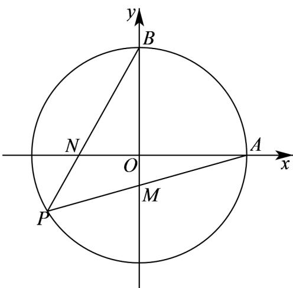

> [!faq]- 《专题09_直线与圆及圆与圆的位置关系高频题型精准突破_九大题型__高效》官方解析
>
> > [!success]- **【答案】** (1) $x^{2}+y^{2}-\frac{8}{3}x-\frac{16}{3}=0$ (2)证明见解析
>
> > [!note]- **【分析】**
> > （1）设 $Q(x,y)$ 、 $P(x_{1},y_{1})$ ，根据平面向量的坐标运算得出 $P\left(\frac{3}{2} x - 2,\frac{3}{2} y\right)$ ，再将点 $_P$ 的坐标代入圆的方程，化简可得出点 $Q$ 的轨迹方程；
> >
> > (2) 设 $P(x_{1}, y_{1})$ ，则 $x_{1}^{2} + y_{1}^{2} = 16$ ，求出直线 $AP$ 、 $BP$ 的方程，可求出点 $M$ 、 $N$ 的坐标，然后利用两点间
> >
> > 的距离公式可计算出 $|AN|\cdot |BM|$ 为定值
>
> > [!note]- **【解析】**
> > （1）根据题意， $A(4,0)$ 、 $B(0,4)$
> >
> > 设 $Q(x,y)$ 、 $P(x_{1},y_{1})$ ，则 $AQ=(x-4,y)$ ， $QP=(x_{1}-x,y_{1}-y)$ ，
> >
> > 由于 $\stackrel{\square\square}{A}Q=2\stackrel{\square\square}{QP}$ ，所以 $(x-4,y)=2(x_{1}-x,y_{1}-y)$ ，
> >
> > 则 $\left\{\begin{aligned}x-4&=2\left(x_{1}-x\right)\\ y&=2\left(y_{1}-y\right)\end{aligned}\right.$ ，得 $\left\{\begin{aligned}x_{1}&=\frac{3}{2}x-2\\ y_{1}&=\frac{3}{2}y\end{aligned}\right.$ ，故 $P\left(\frac{3}{2}x-2,\frac{3}{2}y\right)$ ，
> >
> > 又 $P$ 为圆 $C$ 上，所以 $\left(\frac{3}{2} x - 2\right)^2 +\left(\frac{3}{2} y\right)^2 = 16$ ，化简得 $x^{2} + y^{2} - \frac{8}{3} x - \frac{16}{3} = 0$
> >
> > 故点 Q 的轨迹方程为 $x^{2} + y^{2} - \frac{8}{3}x - \frac{16}{3} = 0$ .
> >
> > (2) 设 $P(x_{1}, y_{1})$ ，则 $x_{1}^{2} + y_{1}^{2} = 16$ ，
> >
> > 
> >
> > 直线 $_{AP}$ 方程是 $y = \frac{y_1}{x_1 - 4}(x - 4)$ ，代入 $x = 0$ ，得 $y = \frac{-4y_1}{x_1 - 4}$ ，即 $M\left(0, \frac{-4y_1}{x_1 - 4}\right)$
> >
> > $x_{1}$ 不等于 $0$ 时，直线 $BP$ 方程是 $y = \frac{y_1 - 4}{x_1} x + 4$ ，代入 $y = 0$ ，得 $x = \frac{-4x_1}{y_1 - 4}$ ，即 $N\left(\frac{-4x_1}{y_1 - 4},0\right)$
> >
> > $x_{1} = 0$ 时，即 $N(0,0)$ ，所以 $N\left(\frac{-4x_1}{y_1 - 4},0\right)$
> >
> > 所以 $\left|AN\right|\cdot\left|BM\right|=\left|4-\frac{-4x_{1}}{y_{1}-4}\right|\cdot\left|4-\frac{-4y_{1}}{x_{1}-4}\right|=16\left|\frac{x_{1}+y_{1}-4}{y_{1}-4}\cdot\frac{x_{1}+y_{1}-4}{x_{1}-4}\right|$
> >
> > $$
> > = 1 6 \left| \frac {x _ {1} ^ {2} + y _ {1} ^ {2} + 2 x _ {1} y _ {1} - 8 x _ {1} - 8 y _ {1} + 1 6}{x _ {1} y _ {1} - 4 x _ {1} - 4 y _ {1} + 1 6} \right| = 1 6 \left| \frac {2 (x _ {1} y _ {1} - 4 x _ {1} - 4 y _ {1} + 1 6)}{x _ {1} y _ {1} - 4 x _ {1} - 4 y _ {1} + 1 6} \right| = 3 2,
> > $$
> >
> > 所以 $|AN|\cdot|BM|$ 为定值.
