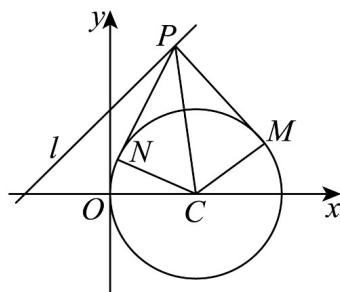
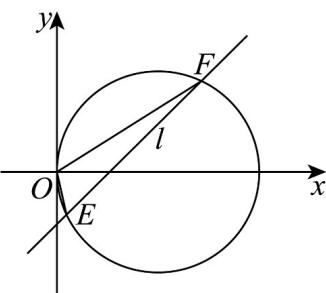

> [!faq]- 《专题09_直线与圆及圆与圆的位置关系高频题型精准突破_九大题型__高效》官方解析
>
> > [!success]- **【答案】** (1) $(x-2)^{2}+y^{2}=4$ (2) $c = -2$ 或 $c = 6$ (3)-3
>
> > [!note]- **【分析】**
> > （1）分析可知圆心 C 为线段 OA 的垂直平分线和线段 OB 垂直平分线的交点，求对应的中垂线方程，进而可得圆心和半径；
> >
> > (2) 根据题意结合切线性质分析可得 $\left|PC\right|$ $2\sqrt{2}$ ，即圆心到直线 l 的距离 $2\sqrt{2}$ ，代入运算即可；
> >
> > (3) 设 $E(x_{1}, y_{1})$ ， $F(x_{2}, y_{2})$ ，联立方程可得 $x_{1} + x_{2} = 3$ ， $x_{1}x_{2} = \frac{1}{2}$ ，利用韦达定理可得 $y_{1}y_{2}$ ，即可得结果
>
> > [!note]- **【解析】**
> > （1）因为圆 $C$ 过 $O(0,0)$ ， $A(4,0)$ ， $B(2,2)$ 三个点，
> >
> > 可知圆心 C 为线段 OA 的垂直平分线和线段 OB 垂直平分线的交点，
> >
> > 且线段 $OA$ 的垂直平分线的方程为 $x = 2$
> >
> > 可得 $k_{OB}=\frac{2}{2}=1$ ，直线 OB 的中点为 $(1,1)$ ，
> >
> > 所以线段 OB 的垂直平分线的方程为 $y-1=-\left(x-1\right)$ ，即 $y=-x+2$ ，
> >
> > 联立方程组 $\left\{ \begin{array}{l}x = 2\\ y = -x + 2 \end{array} \right.$ ，解得 $\left\{ \begin{array}{l}x = 2\\ y = 0 \end{array} \right.$
> >
> > 所以圆心为 $C(2,0)$ ，半径为 $r=|CO|=2$ ，
> >
> > 所以圆 C 的方程为 $(x-2)^{2}+y^{2}=4$ .
> >
> > (2) 因为 $S_{PMCN} = 2S_{\triangle PMC} = 2 \times \frac{1}{2} \times 2 \times |PM| = 2 |PM| = 2 \sqrt{|PC|^{2} - 4}$ 4，解得 $|PC| = 2\sqrt{2}$
> >
> > 当且仅当 $CP \perp l$ 时， $|PC|$ 取到最小值 $2\sqrt{2}$
> >
> > 
> >
> > 即圆心 $C(2,0)$ 到直线 $l: x - y - c = 0$ 的距离 $\frac{|2 - c|}{\sqrt{2}} = 2\sqrt{2}$ ，解得 $c = -2$ 或 $c = 6$ ，
> >
> > 所以 c 的值为 -2 或 6.
> >
> > (3) 若 c=1，则直线 l: x-y-1=0，联立方程 $\left\{ \begin{array}{l} x - y - 1 = 0 \\ (x - 2)^2 + y^2 = 4 \end{array} \right.$ ，消去 $y$ 可得 $2x^{2} - 6x + 1 = 0$
> >
> > 
> >
> > 则 $\Delta = 36 - 8 = 28 > 0$
> >
> > 设 $E\left(x_{1},y_{1}\right)$ ， $F\left(x_{2},y_{2}\right)$ ，则 $x_{1} + x_{2} = 3$ ， $x_{1}x_{2} = \frac{1}{2}$
> >
> > 可得 $y_{1}y_{2} = (x_{1} - 1)(x_{1} - 1) = x_{1}x_{2} - (x_{1} + x_{2}) + 1 = \frac{1}{2} -3 + 1 = -\frac{3}{2}$
> >
> > 所以 $k_{1}k_{2}=\frac{y_{1}}{x_{1}}\cdot\frac{y_{2}}{x_{2}}=\frac{y_{1}y_{2}}{x_{1}x_{2}}=\frac{-\frac{3}{2}}{\frac{1}{2}}=-3$
> >
> > 26. 过圆 $O: x^2 + y^2 = 1$ 外的点 $P(3,3)$ 作 $O$ 的一条切线，切点为 $A$ ，则 $\left|AP\right| = (\quad)$ A. $2\sqrt{2}$ B. $\sqrt{17}$ C. $3\sqrt{2}$ D. 5
> >
> > 【答案】B
> >
> > 【分析】根据圆的方程可得圆心和半径，结合切线的性质求切线长·
> >
> > 【详解】由题意可知：圆 O 的圆心为 $O(0,0)$ ，半径 r=1
> >
> > 所以 $\left|AP\right|^2 = \left|OP\right|^2 - r^2 = 18 - 1 = 17$ ，即 $\left|AP\right| = \sqrt{17}$
> >
> > 故选：B.
> >
> > 27. 过点 $P(m,3)$ 作圆 $C:(x + 2)^{2} + (y + 2)^{2} = 1$ 的切线，切点为 $Q$ ，则 $\left|PQ\right|$ 的最小值为（）A. $2\sqrt{6}$ B.5 C. $\sqrt{26}$ D. $4 + \sqrt{2}$
> >
> > 【答案】A
> >
> > 【分析】根据圆的标准方程得出圆心坐标与半径，再利用切线的性质得到 $|PQ|$ 与 $|PC|$ 的关系，最后根据 $|PC|$ 的最小值求出 $|PQ|$ 的最小值.
> >
> > 【详解】已知圆 C 的方程为 $(x+2)^{2}+(y+2)^{2}=1$ ，可得圆心 $C(-2,-2)$ ，半径 r=1。
> > 因为 PQ 为圆 C 的切线，所以 $CQ \perp PQ$ 在 Rt△PCQ 中，根据勾股定理可得 $\left|PQ\right|^{2}=\left|PC\right|^{2}-\left|CQ\right|^{2}$ .
> > 已知 $\left|CQ\right|=r=1$ ，则 $\left|PQ\right|^{2}=\left|PC\right|^{2}-1$ 点 $P(m,3)$ ，根据两点间距离公式，可得 $\left|PC\right|=\sqrt{(m+2)^{2}+(3+2)^{2}}=\sqrt{(m+2)^{2}+25}$ 因为 $(m+2)^{2}$ 0，当且仅当 m=-2 时， $(m+2)^{2}=0$ ，此时 $\left|PC\right|$ 取得最小值， $\left|PC\right|_{\min}=\sqrt{0+25}=5$ 因为 $\left|PQ\right|^{2}=\left|PC\right|^{2}-1$ ，当 $\left|PC\right|$ 取最小值 5 时， $\left|PQ\right|_{\min}^{2}=5^{2}-1=24$ 则 $\left|PQ\right|_{\min}=\sqrt{24}=2\sqrt{6}$ $\left|PQ\right|$ 的最小值为 $2\sqrt{6}$ .
> >
> > 故选 **A**.
