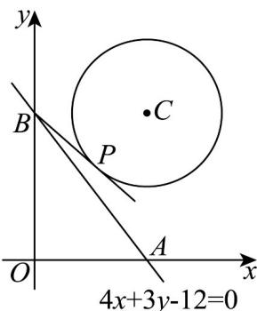

> [!faq]- 《专题09_直线与圆及圆与圆的位置关系高频题型精准突破_九大题型__高效》官方解析
>
> > [!success]- **【答案】** AC
>
> > [!note]- **【分析】**
> > 根据直线与圆的位置关系的判定方法，可得判定 $^{A}$ 正确；由点到直线的距离公式，结合三角形的面积公式，可判定 $^{B}$ 错误；当当 $\angle PBA$ 最小时，直线PB与圆相切，利用切线长公式，可判定 $^{C}$ 正确；根据圆的性质，可得判定 $^{D}$ 错误。
>
> > [!note]- **【解析】**
> > 由圆 $C:(x - 3)^{2} + (y - 4)^{2} = 4$ ，可得圆心为 $C(3,4)$ ，半径为 $r = 2$
> >
> > 对于 ${}^{\mathsf{A}}$ 中，圆心坐标 $C$ 到直线 $4x + 3y - 12 = 0$ 的距离为 $d = \frac{|12 + 12 - 12|}{\sqrt{3^2 + 4^2}} = \frac{12}{5} > r = 2$
> >
> > 所以直线 AB 与圆 C 相离，所以 A 正确；
> >
> > 对于 B 中，由点 C 到直线 $AB$ 的距离为 $\frac{12}{5}$ ，则 VABC 的面积 $S_{\triangle ABC} = \frac{1}{2} \times 5 \times \frac{12}{5} = 6$ ，所以 B 项错误；
> >
> > 对于 $C$ 中，如图所示，当 $\angle PBA$ 最小时，直线 $PB$ 与圆相切，此时 $|PB| = \sqrt{BC^2 - 4} = \sqrt{5}$ ，所以 $C$ 正确；对于 $D$ 中，由点 $P$ 到直线 $AB$ 距离的最大值为 $d + r = \frac{12}{5} + 2 = \frac{22}{5}$ ，所以 $D$ 错误。
> >
> > 
> >
> > 29. 过圆 $O: x^{2} + y^{2} = 1$ 外的点 $P(3,2)$ 作 $O$ 的一条切线，切点为 $M$ ，则 $\left|MP\right| = (\quad)$ A. 2 B. $2\sqrt{3}$ C. $\sqrt{13}$ D. 4
> >
> > 【答案】B
> > 【分析】根据切线的意义知 $OM \perp MP$ ，由勾股定理可求。
> > 【详解】由题意有 $\left|MP\right|^2 = \left|OP\right|^2 - r^2 = 13 - 1 = 12$ ，即 $|MP| = 2\sqrt{3}$ 。
> >
> > 故选 **B**.
