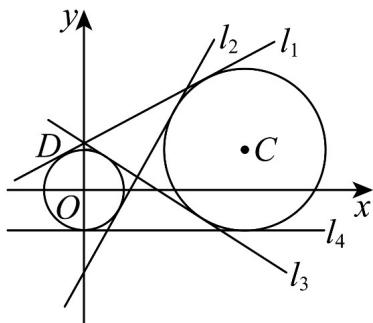

> [!faq]- 《专题09_直线与圆及圆与圆的位置关系高频题型精准突破_九大题型__高效》官方解析
>
> > [!success]- **【答案】** (1) $(x-4)^{2}+(y-1)^{2}=4$ (2) $\frac{8}{15}$
>
> > [!note]- **【分析】**
> > （1）需要先求出圆心坐标和半径·可通过设圆心坐标，利用圆上点到圆心距离等于半径列方程求解·
> >
> > (2) 判断两圆的位置关系，求出两圆的公切线，结合图形，得到满足条件的切线斜率.
>
> > [!note]- **【解析】**
> > （1）设圆 C 的圆心坐标为 $(a,1)$ ，半径为 r·
> >
> > 因为圆 C 过点 $A(4,3)$ 和 $B(2,1)$ ，根据圆的标准方程 $(x-a)^{2}+(y-1)^{2}=r^{2}$ .
> >
> > 对于点 $A(4,3)$ 有 $(4-a)^{2}+(3-1)^{2}=r^{2}$ ，即 $(4-a)^{2}+4=r^{2}$ ①.
> >
> > 对于点 $B(2,1)$ 有 $(2-a)^{2}+(1-1)^{2}=r^{2}$ ，即 $(2-a)^{2}=r^{2}$ ②.
> >
> > 将②代入①可得： $(4-a)^{2}+4=(2-a)^{2}$ .
> >
> > 展开得 $16 - 8a + a^{2} + 4 = 4 - 4a + a^{2}$
> >
> > 移项化简得 $16 + 4 - 4 = 8a - 4a$ ，即 $4a = 16$ ，解得 $a = 4$
> >
> > 把 a = 4 代入②得 $r^{2} = (2 - 4)^{2} = 4$ .
> >
> > 所以圆 C 的标准方程为 $(x-4)^{2}+(y-1)^{2}=4$ .
> >
> > (2) 如图所示，两圆外离，公切线有四条，由于第二象限内的点 D 在圆 O 上显然满足题意的是 $l_{1}$ · 下面求公切线斜率·显然斜率存在，设切线 $y = kx + b$ .
> >
> > 圆心 $O(0,0)$ 到切线 $y = kx + b$ （即 $kx - y + b = 0$ ）的距离 $d_{1} = \frac{|b|}{\sqrt{k^{2} + 1}} = 1$ （\*），
> >
> > 圆心 $C(4,1)$ 到切线 $y = kx + b$ （即 $kx - y + b = 0$ ）的距离 $d_{2} = \frac{|4k - 1 + b|}{\sqrt{k^{2} + 1}} = 2$ （\*\*），
> >
> > <!-- source-part:2 pages:51-52 -->
> >
> > 两个式子比，得到由 $\frac{|b|}{|4k - 1 + b|} = \frac{1}{2}\cdot$ 化简得到 $|4k - 1 + b| = |2b|$
> >
> > 则 $4k - 1 + b = 2b$ 或者 $4k - 1 + b = -2b\cdot$ 即 $b = 4k - 1$ 或者 $b = \frac{1 - 4k}{3}$
> >
> > 当 $b = 4k - 1$ 时，代入方程（\*），得到 $\vert 4k - 1\vert = \sqrt{k^2 + 1}$ ，两边平方整理得 $15k^2 - 8k = 0$ ，解得 $k = 0$ 或 $k = \frac{8}{15}$
> >
> > 当 $b=\frac{1-4k}{3}$ 时，代入方程（\*），同样得到 $7k^{2}-8k-8=0$ ，解得 $k=\frac{4\pm6\sqrt{2}}{7}$ .
> >
> > 由于 $\frac{4 + 6\sqrt{2}}{7} >1 > \frac{8}{15}$ 且由图知道 $0 < k_{l_1} < k_{l_2}$ ，因此， $k_{l_1} = \frac{8}{15}$ .
> >
> > 故满足题意的 $l_{1}$ 的斜率为 $k_{l_{1}}=\frac{8}{15}$ .
> >
> > 
> >
> > 53. 写出圆 $M: (x - 2)^{2} + (y - 1)^{2} = 5$ 与圆 $N: (x + 2)^{2} + (y + 1)^{2} = 5$ 的一条公切线方程
> >
> > 【答案】 $2x + y = 0$ （答案不唯一）
> >
> > 【分析】求出圆 $M$ 与圆 $N$ 外切，两圆相减求出两圆内公切线方程，再设两圆的外公切线所在直线方程，根据点到直线距离公式列出方程，求出答案：
> >
> > 【详解】圆 $M$ 的圆心 $M(2,1)$ ，半径为 $r_1 = \sqrt{5}$ ，圆 $N$ 的圆心为 $N(-2, - 1)$ ，半径为 $r_2 = \sqrt{5}$
> >
> > 故 $\left|MN\right|=\sqrt{(2+2)^{2}+\left(1+1\right)^{2}}=2\sqrt{5}$ ，故圆M与圆N外切，
> >
> > 将 $(x - 2)^{2} + (y - 1)^{2} = 5$ 与 $(x + 2)^{2} + (y + 1)^{2} = 5$ 相减得 $2x + y = 0$
> >
> > 即两圆内公切线方程为 $2x + y = 0$
> >
> > 两圆圆心所在直线方程为 $\frac{y + 1}{1 + 1} = \frac{x + 2}{2 + 2}$ ，即 $x - 2y = 0$
> >
> > 由于两圆半径相等，故两圆的外公切线所在直线方程与 $x - 2y = 0$ 平行，设为 $x - 2y + C = 0$ ，圆心 $M(2,1)$ 到 $x - 2y + C = 0$ 的距离为 $\frac{|2 - 2 + C|}{\sqrt{4 + 1}} = \sqrt{5}$ ，解得 $C = \pm 5$ 故两圆的外公切线所在直线方程为 $x - 2y + 5 = 0$ 和 $x - 2y - 5 = 0$ ：
> >
> > 故答案为： $2x + y = 0$ （ $x - 2y + 5 = 0$ 或 $x - 2y - 5 = 0$ 之一也可以）
> >
> > 54. 圆 $O: x^2 + y^2 = 4$ 与圆 $M: (x - 1)^2 + (y - 2)^2 = 4$ 的公切线的方程可能为（）A. $x - 2y + 2\sqrt{5} = 0$ B. $2x - y - \sqrt{5} = 0$ C. $2x - y - 2\sqrt{5} = 0$ D. $2x - y + 2\sqrt{5} = 0$
> >
> > 【答案】CD
> >
> > ##
> > 【分析】根据圆心距和半径的关系可判断两圆相交，结合圆的半径相等，可得切线斜率，即可由点到直线的距离公式求解：
> >
> > 【详解】圆 O 的圆心为 $O(0,0)$ ，半径为 r=2，圆 M 的圆心为 $M(1,2)$ ，半径 R=2，
> > 由题意得 $\left|OM\right|=\sqrt{1^{2}+2^{2}}=\sqrt{5}$ ，圆 O 与圆 M 的半径之和为 $2+2=4$ ，半径之差为 $^{0}$ ，
> > 因为 $0 < \sqrt{5} < 4$ ，所以圆 O 与圆 M 的位置关系为相交。
> > 由题意得 $k_{OM}=2$ ，因为圆 O 与圆 M 的半径相等，所以公切线的斜率为 $^{2}$ .
> >
> > 设公切线的方程为 $y = 2x + b$ ，即 $2x - y + b = 0$ ，由 $\frac{|0 - 0 + b|}{\sqrt{5}} = 2$ ，得 $b = \pm 2\sqrt{5}$
> >
> > 所以公切线的方程为 $2x - y + 2\sqrt{5} = 0$ 或 $2x - y - 2\sqrt{5} = 0$
> >
> > 故选 **CD**
