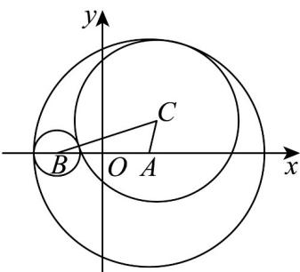

> [!faq]- 《专题10_椭圆标准方程及其性质高频题型精准突破_九大题型__高效培优期》官方解析
>
> > [!success]- **【答案】** C
>
> > [!note]- **【分析】**
> > $(x-2)^{2}+y^{2}=25$ 的圆心为 A，半径 $r_{1}$ ， $(x+2)^{2}+y^{2}=1$ 的圆心为 B，半径 $r_{2}$ ，由动圆 C 与圆 $(x-2)^{2}+y^{2}=25$ 内切，设动圆半径为 r，求出 $\left|CA\right|=r_{1}-r$ ，动圆 C 与圆 $(x+2)^{2}+y^{2}=1$ 外切，求出 $\left|CB\right|=r_{2}+r$ ，则有 $\left|CA\right|+\left|CB\right|$ 为定值，结合椭圆的定义得解。
>
> > [!note]- **【解析】**
> > 
> >
> > 的圆心为，半径
> >
> > $$
> > (x - 2) ^ {2} + y ^ {2} = 2 5
> > $$
> >
> > $$
> > r _ {1} = 5
> > $$
> >
> > $\left(x + 2\right)^{2} + y^{2} = 1$ 的圆心为 $B(-2,0)$ ，半径 $r_2 = 1$
> >
> > $\because$ 动圆 $C$ 与圆 $(x - 2)^{2} + y^{2} = 25$ 内切，设动圆半径为 $r$ ， $\therefore |CA| = r_1 - r = 5 - r$ ，动圆 $C$ 与圆 $(x + 2)^{2} + y^{2} = 1$ 外切， $\therefore |CB| = r_2 + r = 1 + r$
> >
> > $$
> > \therefore | C A | + | C B | = 6 = 2 a
> > $$
> >
> > $$
> > \left| A B \right| = 4 = 2 c
> > $$
> >
> > ∵ 2a > 2c，∴ 动圆 C 的轨迹是以 A, B 为焦点的椭圆，
> > ∵ a=3,c=2，∴ $b^{2}=a^{2}-c^{2}=5$
> >
> > ∴ 动圆 C 的轨迹方程为 $\frac{x^{2}}{9} + \frac{y^{2}}{5} = 1$ .
> >
> > 故选 **C**.
