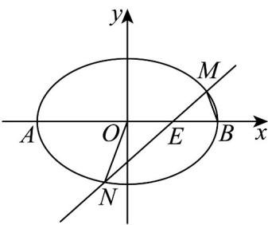

> [!faq]- 《专题10_椭圆标准方程及其性质高频题型精准突破_九大题型__高效培优期》官方解析
>
> > [!success]- **【答案】** (1) $\frac{x^{2}}{4}+\frac{y^{2}}{2}=1(x\neq\pm2)$ (2) $\frac{\sqrt{30}}{6}$ 或 $-\frac{\sqrt{30}}{6}$
>
> > [!note]- **【分析】**
> > （1）设 $P(x,y)$ ，根据 $k_{PA} \cdot k_{PB} = -\frac{1}{2}$ 列方程化简可得结果
> >
> > (2) 设 $l: x = my + 1$ ， $M(x_1, y_1), N(x_2, y_2)$ ，根据三角形面积关系可得 $\left|y_2\right| = 2\left|y_1\right|$ ，结合韦达定理计算可得结果·
>
> > [!note]- **【解析】**
> > （1）设 $P(x,y)$ ，则 $k_{PA}=\frac{y}{x+2},k_{PB}=\frac{y}{x-2}$ ，
> >
> > 由 $k_{PA} \cdot k_{PB} = \frac{y}{x + 2} \cdot \frac{y}{x - 2} = -\frac{1}{2}$ 得， $\frac{x^2}{4} + \frac{y^2}{2} = 1 (x \neq \pm 2)$
> >
> > 所以曲线 C 的方程为 $\frac{x^{2}}{4} + \frac{y^{2}}{2} = 1 (x \neq \pm 2)$ .
> >
> > (2)
> >
> > 
> >
> > 由题意得直线 $l$ 的斜率不为0，设 $l: x = my + 1$ ， $M(x_1, y_1), N(x_2, y_2)$
> >
> > 由 $\left\{ \begin{array}{l} x = my + 1 \\ \frac{x^2}{4} + \frac{y^2}{2} = 1 \end{array} \right.$ 得， $\left(m^2 + 2\right)y^2 + 2my - 3 = 0$
> >
> > 所以 $y_{1} + y_{2} = -\frac{2m}{m^{2} + 2}, y_{1}y_{2} = -\frac{3}{m^{2} + 2}$
> >
> > 因为 $\triangle NOE$ 的面积是 $\triangle MBE$ 的面积的 2 倍，
> >
> > 所以 $\frac{1}{2}\left|OE\right|\cdot \left|y_2\right| = 2\cdot \frac{1}{2}\left|EB\right|\cdot \left|y_1\right|$
> >
> > 因为 $|OE| = |EB| = 1$ ，所以 $|y_2| = 2|y_1|$
> >
> > 由题意得， $y_{1},y_{2}$ 符号相反，故 $y_{2}=-2y_{1}$
> >
> > 所以 $y_{1} + y_{2} = -y_{1} = -\frac{2m}{m^{2} + 2}, y_{1}y_{2} = -2y_{1}^{2} = -\frac{3}{m^{2} + 2}$
> >
> > 所以 $2 \times \left(\frac{2m}{m^2 + 2}\right)^2 = \frac{3}{m^2 + 2}$ ，解得 $m = \pm \sqrt{\frac{6}{5}}$ ，
> >
> > 所以直线 l 的斜率为 $\frac{\sqrt{30}}{6}$ 或 $-\frac{\sqrt{30}}{6}$ .
> >
> > 21. 长为 $^{3}$ 的线段AB的两个端点A和B分别在x轴和y轴上滑动，则点A关于点B对称的点M的轨迹方程为（）
> >
> > A. $\frac{x^{2}}{6} + \frac{y^{2}}{3} = 1$ B. $\frac{y^{2}}{6} + \frac{x^{2}}{3} = 1$ C. $\frac{x^{2}}{36} + \frac{y^{2}}{9} = 1$ D. $\frac{y^{2}}{36} + \frac{x^{2}}{9} = 1$
> >
> > 【答案】D
> >
> > 【分析】利用中点求出 $M$ 的坐标，利用相关点法即可求解
> >
> > 【详解】设 依题意有 $\left\{ \begin{array}{l}x + a = 0\\ y = 2b \end{array} \right.$ ，即 $\left\{ \begin{array}{l}x = -a\\ b = \frac{y}{2} \end{array} \right.$
> >
> > 所以 $\left|AB\right|=\sqrt{a^{2}+b^{2}}=\sqrt{x^{2}+\frac{y^{2}}{4}}=3$ ，即 $x^{2}+\frac{y^{2}}{4}=9$ ，所以 $\frac{x^{2}}{9}+\frac{y^{2}}{36}=1$ ，
> >
> > 故选 **D**.
