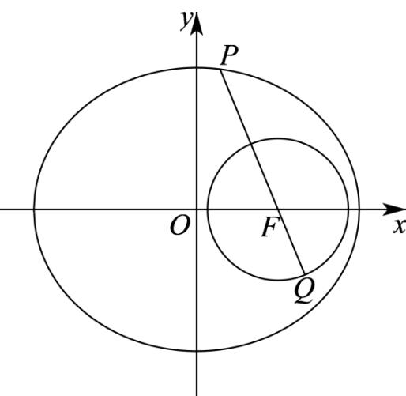

> [!faq]- 《专题10_椭圆标准方程及其性质高频题型精准突破_九大题型__高效培优期》官方解析
>
> > [!success]- **【答案】** A
>
> > [!note]- **【分析】**
> > 设 $P(x,y)$ ，则 $-4 \leq x \leq 4$ ，利用椭圆的焦半径公式求出 $|PF|$ 的取值范围，再结合圆的几何性质可求得 $|PQ|$ 的取值范围。
>
> > [!note]- **【解析】**
> > 在椭圆 C 中，a=4， $b=2\sqrt{3}$ ，则 $c=\sqrt{a^{2}-b^{2}}=2$ ，即 $F(2,0)$ ，
> >
> > 设点 $P(x,y)$ ，则 $-4\leq x\leq 4$ ，且 $\frac{x^2}{16} +\frac{y^2}{12} = 1$ ，可得 $y^{2} = 12 - \frac{3x^{2}}{4}$
> >
> > 所以 $\left|PF\right|=\sqrt{(x-2)^{2}+y^{2}}=\sqrt{x^{2}-4x+4+12-\frac{3x^{2}}{4}}=\sqrt{\frac{x^{2}}{4}-4x+16}=4-\frac{x}{2}\in[2,6]$
> >
> > 所以 $\left|PQ\right|\leq\left|PF\right|+\left|FQ\right|=\left|PF\right|+\sqrt{3}\leq6+\sqrt{3}$
> >
> > 当且仅当 P 为椭圆的左端点，且 Q 为射线 PF 与圆 $C'$ 的交点时，上述不等式中的两个等号同时成立， $\left|PQ\right|\left\|PF\right|-\left|FQ\right\|=\left|PF\right|-\sqrt{3}\quad2-\sqrt{3}$
> >
> > 当且仅当 $P$ 为椭圆的右端点，且 $Q$ 为线段 $PF$ 与圆 $C'$ 的交点时，上述不等式中的两个等号同时成立，
> >
> > 
> >
> > 综上所述， $\left|PQ\right|$ 的取值范围是 $\left[2-\sqrt{3},6+\sqrt{3}\right]$ .
> >
> > 故选 **A**.
