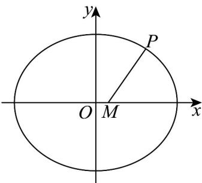

> [!faq]- 《专题10_椭圆标准方程及其性质高频题型精准突破_九大题型__高效培优期》官方解析
>
> > [!success]- **【答案】** $\left[\frac{\sqrt{2}}{2}, +\infty\right)$
>
> > [!note]- **【分析】**
> > 设 $S(x_{0}, y_{0})$ ，利用两点间距离公式建立函数关系，借助二次函数探讨最小值。
>
> > [!note]- **【解析】**
> > 椭圆方程为 $\frac{x^2}{2} + y^2 = 1$ ，则圆的右顶点 $A(\sqrt{2}, 0)$
> >
> > 设 $S(x_0,y_0)$ ，则 $\frac{x_0^2}{2} +y_0^2 = 1$ ， $x_0\in [-\sqrt{2},\sqrt{2} ]$
> >
> > $$
> > \left| S T \right| ^ {2} = \left(x _ {0} - t\right) ^ {2} + y _ {0} ^ {2} = x _ {0} ^ {2} - 2 t x _ {0} + t ^ {2} + 1 - \frac {x _ {0} ^ {2}}{2} = \frac {1}{2} x _ {0} ^ {2} - 2 t x _ {0} + t ^ {2} + 1
> > $$
> >
> > 所以 $\left|ST\right|^{2}=\frac{1}{2}(x_{0}-2t)^{2}-t^{2}+1,\quad x_{0}\in[-\sqrt{2},\sqrt{2}]$
> >
> > 当S恰与点A重合时， $\left|ST\right|$ 取得最小值，
> >
> > 即要使 $x_0 = \sqrt{2}$ 时 $\left|ST\right|^2$ 取最小值，则必有 $2t - \sqrt{2}$ ，所以 $t - \frac{\sqrt{2}}{2}$
> >
> > 故答案为： $\left[\frac{\sqrt{2}}{2},+\infty\right)$
> >
> > 29. 一动圆与圆 $O_{1}: x^{2} + y^{2} + 6x + 5 = 0$ 外切，同时与圆 $O_{2}: x^{2} + y^{2} - 6x - 91 = 0$ 内切.
> >
> > (1)求动圆圆心 $M$ 的轨迹方程；
> >
> > (2)记（1）所求轨迹方程对应的曲线为 $E$ ，点 $P$ 为曲线 $E$ 上一动点，点 $M$ 的坐标为 $(1,0)$ ，求点 $P$ 到点 $M$ 距离的最小值，并给出此时点 $P$ 的坐标．
> >
> > 【答案】(1) $\frac{x^{2}}{36}+\frac{y^{2}}{27}=1$
> >
> > (2) $\left|PM\right|$ 最小值为 $2\sqrt{6}$ ，点P的坐标为 $(4,\sqrt{15})$ 或 $(4,-\sqrt{15})$
> >
> > 【分析】（1）设动圆圆心为 $M(x,y)$ ，由条件可得关系 $\left|O_1M\right| + \left|O_2M\right| = 12 > \left|O_1O_2\right|$ ，结合椭圆定义判断 $M$ 的轨迹形状及位置，再利用待定系数法求椭圆方程；
> >
> > (2) 设 $P(x,y)$ ，表示 $\left|PM\right|$ ，结合关系点 $P(x,y)$ 在椭圆上，消 y，求其最小值可得结论.
> >
> > 【详解】（1）设动圆圆心为 $M(x,y)$ ，半径为 $R$ ，
> >
> > 设圆 $x^{2} + y^{2} + 6x + 5 = 0$ 和圆 $x^{2} + y^{2} - 6x - 91 = 0$ 的圆心分别为 $O_{1}, O_{2}$
> >
> > 将圆的方程分别配方得：圆 $O_{1}:(x + 3)^{2} + y^{2} = 4$ ，圆 $O_{2}:(x - 3)^{2} + y^{2} = 100$
> >
> > 当动圆 M 与圆 $O_{1}$ 相外切时，有 $\left|O_{1}M\right|=R+2$ ①
> >
> > 当动圆 $M$ 与圆 $O_{2}$ 相内切时，有 $\left|O_2M\right| = 10 - R$
> >
> > 将①②两式相加，得 $\left|O_{1}M\right|+\left|O_{2}M\right|=12>\left|O_{1}O_{2}\right|$ ，
> >
> > 所以动圆圆心 $M(x,y)$ 到点 $O_{1}(-3,0)$ 和 $O_{2}(3,0)$ 的距离和是常数12，
> >
> > 所以点 $M$ 的轨迹是焦点为点 $O_{1}(-3,0), O_{2}(3,0)$ ，长轴长等于12的椭圆。
> >
> > 设该椭圆的标准方程为 $\frac{x^2}{a^2} +\frac{y^2}{b^2} = 1(a > b > 0)$ ；椭圆的半焦距为 $c$ ，
> >
> > 则 2c = 6 ， 2a = 12 ，
> >
> > 所以 c = 3, a = 6
> >
> > 所以 $b^{2} = 36 - 9 = 27$
> >
> > 所以动圆圆心轨迹方程为 $\frac{x^2}{36} +\frac{y^2}{27} = 1$
> >
> > (2) 根据题意得：设 $P(x, y), |PM| = \sqrt{(x - 1)^2 + y^2}$
> >
> > 因为点 $P(x,y)$ 在椭圆上，所以 $\frac{x^2}{36} +\frac{y^2}{27} = 1$ ，故 $y^{2} = 27\left(1 - \frac{x^{2}}{36}\right)$
> >
> > 所以 $\left|PM\right|=\sqrt{\frac{1}{4}(x-4)^{2}+24},-6\leq x\leq6$
> >
> > 所以当 $x = 4$ 时， $\left|PM\right|$ 最小值为 $2\sqrt{6}$ ，此时点 $P$ 的坐标为 $\left(4, \sqrt{15}\right)$ 或 $\left(4, -\sqrt{15}\right)$
> >
> > 
