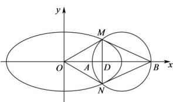

> [!faq]- 《专题10_椭圆标准方程及其性质高频题型精准突破_九大题型__高效培优期》官方解析
>
> > [!success]- **【答案】** AB
>
> > [!note]- **【分析】**
> > 求出以 AB 为直径的圆方程，与椭圆方程联立求出 M, N 的坐标，再逐项求解判断
>
> > [!note]- **【解析】**
> > 依题意，以 AB 为直径的圆的方程为 $(x-2)^{2}+y^{2}=1$ ，
> >
> > 选项A，由 $\left\{ \begin{array}{l}(x - 2)^2 +y^2 = 1\\ x^2 +4y^2 = 4 \end{array} \right.$ 及对称性得 $M(\frac{4}{3},\frac{\sqrt{5}}{3}),N(\frac{4}{3}, - \frac{\sqrt{5}}{3})$ ，则 $\left|M N\right| = \frac{2\sqrt{5}}{3}$ ，A正确；选项B，直线方程为 $y = \frac{\frac{\sqrt{5}}{3}}{\frac{4}{3} - 3} (x - 3)$ ，即 $y = -\frac{\sqrt{5}}{5} (x - 3)$ ，由 $\left\{ \begin{array}{l}y = -\frac{\sqrt{5}}{5} (x - 3)\\ \frac{x^2}{4} +y^2 = 1 \end{array} \right.$
> >
> > 得 $9x^{2}-24x+16=0$ ， $\Delta=24^{2}-4\times9\times16=0$ ，直线BM与C只有一个交点， $^{B}$ 正确；
> >
> > 
> >
> > 选项 C，设直线 MN 与 x 轴交点为 $D(\frac{4}{3},0)$ ， $|OD|=\frac{4}{3}$ ， $|DB|=3-\frac{4}{3}=\frac{5}{3}$ ，
> >
> > $|OD|\neq|DB|$ ，四边形 OMBN 不是平行四边形，C 错误；
> >
> > 选项D，设 $P(u,v)$ ，则 $\frac{u^2}{4} +v^2 = 1$ ， $\overrightarrow{PM} = (\frac{4}{3} -u,\frac{\sqrt{5}}{3} -v)$ ， $\overrightarrow{PN} = (\frac{4}{3} -u, - \frac{\sqrt{5}}{3} -v)$
> >
> > $$
> > P M \cdot P N = \left(\frac {4}{3} - u\right) ^ {2} + v ^ {2} - \frac {5}{9} = \frac {3}{4} u ^ {2} - \frac {8}{3} u + \frac {2 0}{9} = \frac {3}{4} \left(u - \frac {1 6}{9}\right) ^ {2} - \frac {4}{2 7}
> > $$
> >
> > 而 $u \in [-2, 2]$ ，因此当 $u = -2$ 时， $(PM \cdot PN)_{\max} = \frac{95}{9}$ ，D 错误。
> >
> > 故选：AB
> >
> > ## 考点06 求椭圆离心率定值问题
