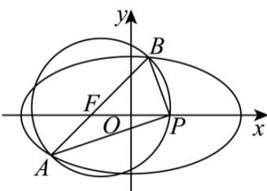

> [!faq]- 《专题10_椭圆标准方程及其性质高频题型精准突破_九大题型__高效培优期》官方解析
>
> > [!success]- **【答案】** ACD
>
> > [!note]- **【分析】**
> > 根据焦点与离心率求出椭圆方程为： $\frac{x^{2}}{4}+\frac{y^{2}}{3}=1$ ，再根据椭圆性质，直线与椭圆的位置关系对选项逐一判断即可。
>
> > [!note]- **【解析】**
> > 由题知椭圆焦点在 x 轴上，又直线 x = my - 1 过点 $(-1,0)$ ，所以 $F(-1,0)$ ，即 c = 1，
> >
> > 又 $\frac{c}{a} = \frac{1}{2},\therefore a = 2,c = 1,b^2 = a^2 -c^2 = 3$ ，椭圆方程为： $\frac{x^2}{4} +\frac{y^2}{3} = 1$
> >
> > 对于 $\mathsf{A}$ ，椭圆短轴长为 $2b = 2\sqrt{3}$ ，故 $\mathsf{A}$ 正确；
> >
> > 对于 B，联立 $\left\{\begin{aligned}x&=my-1\\ \frac{x^{2}}{4}+\frac{y^{2}}{3}&=1\end{aligned}\right.$ ，消去 整理得： $(3m^{2}+4)y^{2}-6my-9=0,\Delta>0$ 恒成立，
> >
> > 设 $A(x_{1},y_{1}),B(x_{2},y_{2})$ ，则 $y_{1} + y_{2} = \frac{6m}{3m^{2} + 4},y_{1}y_{2} = \frac{-9}{3m^{2} + 4}$
> >
> > $$
> > \left| A B \right| = \sqrt {\left(x _ {1} - x _ {2}\right) ^ {2} + \left(y _ {1} - y _ {2}\right) ^ {2}} = \sqrt {\left(m y _ {1} - 1 - m y _ {2} + 1\right) ^ {2} + \left(y _ {1} - y _ {2}\right) ^ {2}}
> > $$
> >
> > $$
> > = \sqrt {m ^ {2} + 1} \cdot \sqrt {\left(y _ {1} + y _ {2}\right) ^ {2} - 4 y _ {1} y _ {2}} = \sqrt {m ^ {2} + 1} \cdot \sqrt {\frac {3 6 m ^ {2}}{\left(3 m ^ {2} + 4\right) ^ {2}} + \frac {3 6}{3 m ^ {2} + 4}}
> > $$
> >
> > $= \frac{12(m^2 + 1)}{3m^2 + 4} = 4(1 - \frac{1}{3m^2 + 4})$ ，因为 $m\in \mathbf{R}$ ，故 $\left|AB\right| <   4$ ，无最大值，故B不正确；
> >
> > 
> >
> > 对于 $C$ ，若 $AB$ 为直径的圆恰好过点 $P(1,0)$ ，则 $AP \perp BP$
> >
> > 即 $PA \cdot PB = 0, \therefore (x_1 - 1)(x_2 - 1) + y_1y_2 = 0, \therefore (my_1 - 2)(my_2 - 2) + y_1y_2 = 0$
> >
> > 即 $(m^2 + 1)y_1y_2 - 2m(y_1 + y_2) + 4 = 0$
> >
> > 即 $\frac{-9(m^2 + 1)}{3m^2 + 4} - \frac{12m^2}{3m^2 + 4} + 4 = 0$ ，解得： $m = \pm \frac{\sqrt{7}}{3}$ ，
> >
> > 故存在实数 m，使得以 AB 为直径的圆恰好过点 $(1,0)$ ，C 正确；
> >
> > 对于 D，若 $3AF = AB$ ，即 $3(0 - y_{1}) = 2(y_{2} - y_{1}), \therefore y_{1} = -2y_{2}$
> >
> > 故 $\left\{ \begin{array}{l} -y_{2} = \frac{6m}{3m^{2} + 4}\\ -2y_{2}^{2} = \frac{-9}{3m^{2} + 4} \end{array} \right.$ ，解得： $m = \pm \frac{2\sqrt{5}}{5}$ ，所以D正确.
> >
> > 故选 **ACD**
