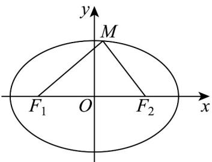

> [!faq]- 《专题10_椭圆标准方程及其性质高频题型精准突破_九大题型__高效培优期》官方解析
>
> > [!success]- **【答案】** C
>
> > [!note]- **【分析】**
> > 先根据 $^{\triangle}MF_{1}F_{2}$ 为直角三角形分三类讨论，利用椭圆的对称性可分析出以点 $F_{1}$ 、 $F_{2}$ 和M为直角顶点的点M的个数；再利用余弦定理及判断一元二次方程根的个数的方法得出 $a<\sqrt{2}c$ ；最后根据离心率的求法及椭圆离心率的范围即可求解·
>
> > [!note]- **【解析】**
> > 
> >
> > 为直角三角形，可分为以下三类讨论：
> >
> > $\triangle MF_{1}F_{2}$
> >
> > 以点 $F_{1}$ 为直角顶点；以点 $F_{2}$ 为直角顶点；以点 M 为直角顶点。
> >
> > 由椭圆的对称性可知：以点 $F_{1}$ 为直角顶点的点 $M$ 有两个；以点 $F_{2}$ 为直角顶点的点 $M$ 有两个，则要使 $\triangle MF_1F_2$ 为直角三角形的点 $M$ 有8个，须使以点 $M$ 为直角顶点的直角三角形有4个。由椭圆的对称性可得在 $x$ 轴上方有两个点 $M$ 满足以点 $M$ 为直角顶点。
> >
> > 则 $\cos \angle F_{1}MF_{2} = \frac{\left|MF_{1}\right|^{2} + \left|MF_{2}\right|^{2} - \left|F_{1}F_{2}\right|^{2}}{2\left|MF_{1}\right|\left|MF_{2}\right|} = 0$
> >
> > 即 $\left|MF_1\right|^2 +\left|MF_2\right|^2 -\left|F_1F_2\right|^2 = \left|MF_1\right|^2 +\left(2a - \left|MF_1\right|\right)^2 -\left(2c\right)^2 = 2\left|MF_1\right|^2 -2\times 2a\times \left|MF_1\right| + 4\left(a^2 -c^2\right) = 0$
> >
> > 所以 $\Delta = (-2\times 2a)^{2} - 4\times 2\times 4(a^{2} - c^{2}) > 0$ ，解得 $a^2 < 2c^2$ 即 $a < \sqrt{2} c$
> >
> > 所以 $e = \frac{c}{a} >\frac{\sqrt{2}}{2}$
> >
> > 又因为椭圆离心率 $e < 1$
> >
> > 所以 $\frac{\sqrt{2}}{2} < e < 1$ .
> >
> > 故选 **C**.
