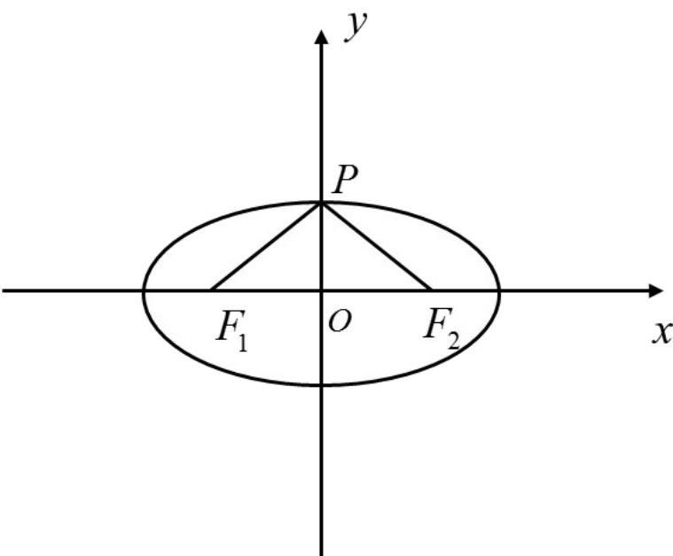

> [!faq]- 《专题10_椭圆标准方程及其性质高频题型精准突破_九大题型__高效培优期》官方解析
>
> > [!success]- **【答案】** BD
>
> > [!note]- **【分析】**
> > A. 设 $P(x_{0}, y_{0})$ ， $k_{PA_{1}} \cdot k_{PA_{2}} = -\frac{3}{4}$ ，所以该选项错误；
> >
> > B. 求出 $\triangle PF_{1}F_{2}$ 的面积为 $\frac{1}{2} \cdot |PF_{1}| \cdot |PF_{2}| = b^{2}$ , 所以该选项正确;
> >
> > C. 求出 $e \in (\frac{\sqrt{2}}{2}, 1)$ ，所以该选项错误；
> >
> > D. 若 $\left|PF_{1}\right|\leq2b$ 恒成立，所以 $0<e\leq\frac{3}{5}$ ，所以该选项正确。
>
> > [!note]- **【解析】**
> > 解：A. 设 $P(x_0, y_0)$ ，所以 $\frac{x_0^2}{a^2} + \frac{y_0^2}{b^2} = 1$ ，因为 $e = \frac{c}{a} = \frac{1}{2}, \therefore a = 2c, \therefore a^2 = \frac{4}{3}b^2$
> >
> > 所以 $\frac{x_0^2}{3b^2} +\frac{y_0^2}{b^2} = 1,\therefore 3x_0^2 +4y_0^2 = 4b^2$ 所以 $k_{PA_1}\cdot k_{PA_2} = \frac{y_0 - b}{x_0}\cdot \frac{y_0 + b}{x_0} = \frac{y_0^2 - b^2}{x_0^2} = \frac{b^2 - \frac{3}{4}x_0^2 - b^2}{x_0^2} = -\frac{3}{4}$ ，所以该
> >
> > 选项错误；
> >
> > B. 若 $PF_{1} \perp PF_{2}$ ，则 $\left|PF_{1}\right| + \left|PF_{2}\right| = 2a, \left|PF_{1}\right|^{2} + \left|PF_{2}\right|^{2} = 4c^{2}$ ，所以 $\left|PF_{1}\right| \cdot \left|PF_{2}\right| = 2b^{2}$ ，则 $\triangle PF_{1}F_{2}$ 的面积为
> >
> > $\frac{1}{2}\cdot\left|PF_{1}\right|\cdot\left|PF_{2}\right|=b^{2}$ ，所以该选项正确；
> >
> > C. 若 C 上存在四个点 P 使得 $PF_{1} \perp PF_{2}$ ，即 C 上存在四个点 P 使得 $\triangle PF_{1}F_{2}$ 的面积为 $b^{2}$ ，所以
> >
> > $\frac{1}{2} \cdot 2c \cdot b > b^2, \therefore c > b, \therefore c^2 > a^2 - c^2, \therefore e \in (\frac{\sqrt{2}}{2}, 1)$ ，所以该选项错误；
> >
> > $$
> > \left| P F _ {1} \right| \leq 2 b
> > $$
> >
> > $$
> > a + c \leq 2 b, \therefore a ^ {2} + c ^ {2} + 2 a c \leq 4 b ^ {2} = 4 \left(a ^ {2} - c ^ {2}\right)
> > $$
> >
> > $$
> > 5 e ^ {2} + 2 e - 3 \leq 0, \therefore 0 <   e \leq \frac {3}{5}
> > $$
> >
> > 以该选项正确·
> >
> > 故选：BD
> >
> > 40. 椭圆 $\frac{x^2}{a^2} + \frac{y^2}{b^2} = 1 (a > b > 0)$ 上存在一点 $P$ 满足 $F_1 P \perp F_2 P$ ， $F_1, F_2$ 分别为椭圆的左右焦点，则椭圆的离心率的范围是（）A. $(0, \frac{1}{2}]$ B. $(0, \frac{\sqrt{2}}{2}]$ C. $[\frac{1}{2}, 1)$ D. $[\frac{\sqrt{2}}{2}, 1)$
> >
> > 【答案】D
> >
> > 【分析】当点 $P$ 位于短轴的端点时， $\angle F_{1}PF_{2}$ 最大，要使椭圆 $\frac{x^2}{a^2} + \frac{y^2}{b^2} = 1 (a > b > 0)$ 上存在一点 $P$ 满足 $F_{1}P \perp F_{2}P$ ，只要 $\angle F_{1}PF_{2}$ 最大时大于等于 $\frac{\pi}{2}$ 即可，从而可得出答案。
> >
> > 【详解】解：当点 $P$ 位于短轴的端点时， $\angle F_{1}PF_{2}$ 最大，
> >
> > 要使椭圆 $\frac{x^2}{a^2} + \frac{y^2}{b^2} = 1 (a > b > 0)$ 上存在一点 $P$ 满足 $F_{1}P \perp F_{2}P$ ，
> >
> > 只要 $\angle F_{1}PF_{2}$ 最大时大于等于 $\frac{\pi}{2}$ 即可，
> >
> > 即当点 $P$ 位于短轴的端点时， $\angle OPF_{1} = \frac{\pi}{4}$ ，
> >
> > 所以 $\sin \angle OPF_{1} = \frac{c}{a} \sin \frac{\pi}{4} = \frac{\sqrt{2}}{2}$ ，
> >
> > 又椭圆的离心率 $0 < e < 1$ ，
> >
> > 所以椭圆的离心率的范围是 $\left[\frac{\sqrt{2}}{2}, 1\right)$ .
> >
> > 故选：D.
> >
> > 
