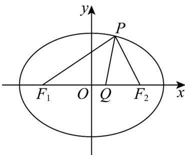

> [!faq]- 《专题10_椭圆标准方程及其性质高频题型精准突破_九大题型__高效培优期》官方解析
>
> > [!success]- **【答案】** $\left(\frac{1}{3}, 1\right)$
>
> > [!note]- **【分析】**
> > 由已知结合三角形内角平分线定理可得 $\left|PF_{1}\right|=2\left|PF_{2}\right|$ ，再由椭圆定义可得 $\left|PF_{2}\right|=\frac{2a}{3}$ ，得到a-c $<\frac{2a}{3}<a+c$ ，从而得到 $e=\frac{c}{a}>\frac{1}{3}$ ，再与椭圆离心率的范围取交集得答案.
>
> > [!note]- **【解析】**
> > $\because |QF_2| = 2|OQ|$ ， $\therefore |QF_2| = \frac{2}{3} c$ ， $|QF_1| = \frac{4}{3} c$ ， $\because PQ$ 是 $\angle F_{1}PF_{2}$ 的角平分线， $\therefore \frac{|PF_1|}{|PF_2|} = \frac{\frac{4}{3}c}{\frac{2}{3}c} = 2$ ，则 $\left|PF_1\right| = 2\left|PF_2\right|$ ，由 $\left|PF_1\right| + \left|PF_2\right| = 3\left|PF_2\right| = 2a$ ，得 $\left|PF_2\right| = \frac{2a}{3}$
> >
> > 由 $a - c < \frac{2a}{3} < a + c$ ，可得 $e = \frac{c}{a} >\frac{1}{3}$ ，由 $0 < e < 1$ ，：椭圆离心率的范围是 $\left(\frac{1}{3},1\right)$ 故答案为： $\left(\frac{1}{3},1\right)$
> >
> > 
> >
> > 42. 椭圆焦点在 $x$ 轴上， $A$ 为该椭圆右顶点， $P$ 在椭圆上一点， $\angle OPA = 90^{\circ}$ ，则该椭圆的离心率 $e$ 的范围是
> > A. $[\frac{1}{2}, 1)$ B. $(\frac{\sqrt{2}}{2}, 1)$ C. $[\frac{1}{2}, \frac{\sqrt{6}}{3})$ D. $(0, \frac{\sqrt{2}}{2})$
> >
> > 【答案】B
> >
> > 【分析】根据平面向量数量积的坐标表示公式，结合一元二次方程根与系数的关系、椭圆离心率公式进行求解即可·
> >
> > 【详解】设 $P(x,y)$ ，则 $\overline{OP} = (x,y),\overline{AP} = (x - a,y)$ .又由于 $\angle OPA = 90^0$ ，所以 $\overline{OP}\cdot \overline{AP} = 0$ 即可得 $(x - \frac{a}{2})^{2} + y^{2} = (\frac{a}{2})^{2}$
> >
> > 所以点 $P$ 在以 $OA$ 为直径的圆上．且椭圆与该圆有公共点．
> >
> > 由 $(x - \frac{a}{2})^2 + y^2 = (\frac{a}{2})^2 \Rightarrow y^2 = (\frac{a}{2})^2 - (x - \frac{a}{2})^2$ ，代入 $\frac{x^2}{a^2} + \frac{y^2}{b^2} = 1$ ，得 $x^2(b^2 - a^2) + a^3 x - a^2 b^2 = 0$ 。由于过点 $A$ 所以有一个根为 $a$ ，另一个根设为 $x$ ，则由韦达定理可得 $x + a = -\frac{a^3}{b^2 - a^2} = \frac{a^3}{c^2}$ 。又因为 $0 < x < a$ 。所以解得 $e > \frac{\sqrt{2}}{2}$ ，而 $e < 1$ ，
> >
> > 故选：B.
> >
> > ## 考点08 椭圆对称问题
