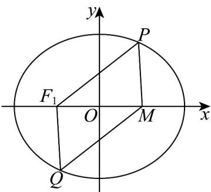

> [!faq]- 《专题10_椭圆标准方程及其性质高频题型精准突破_九大题型__高效培优期》官方解析
>
> > [!success]- **【答案】** A
>
> > [!note]- **【分析】**
> > 根据椭圆的定义和椭圆的性质求解即可得
>
> > [!note]- **【解析】**
> > 由 $W:\frac{x^2}{4} +\frac{y^2}{3} = 1$ 知， $a = 2,b = \sqrt{3},c = 1$
> >
> > 所以焦点坐标为 $F_{1}(-1,0), F_{2}(1,0)$ ，则
> >
> > 又 $M(1,0)$ ，所以 $M(1,0)$ 是椭圆的右焦点，
> >
> > 所以 $\left|PF_{1}\right|+\left|PF_{2}\right|=4$ ，即 $\left|PF_{1}\right|+\left|PM\right|=4$
> >
> > 若 $\left|PM\right|+\left|QM\right|=4$ ，则 $\left|PF_{1}\right|=\left|QM\right|$
> >
> > 根据椭圆的对称性得，P、Q 关于原点对称即可满足条件，
> >
> > 又 $P$ 是椭圆上任一点，则关于原点对称点 $Q$ 存在，故①对；
> >
> > 
> >
> > 因为 $P$ 是椭圆上任一点，又 $M(\sqrt{5},0)$ ，所以 $\sqrt{5} - 2 \leq |PM| \leq 2 + \sqrt{5}$ ， $\sqrt{5} - 2 \leq |QM| \leq 2 + \sqrt{5}$
> >
> > 所以 $\left(\sqrt{5} - 2\right)^2 \leq |PM||QM| \leq (2 + \sqrt{5})^2$
> >
> > 又 $1 \in \left[\left(\sqrt{5} - 2\right)^{2}, \left(2 + \sqrt{5}\right)^{2}\right]$
> >
> > 所以对任意的点 P，都存在点 Q，使得 $\left|PM\right|\left|QM\right|=1$
> >
> > 故②对；
> >
> > 故选 **A**
