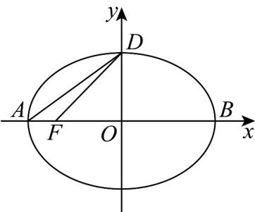
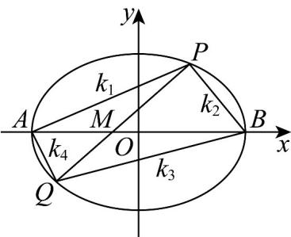
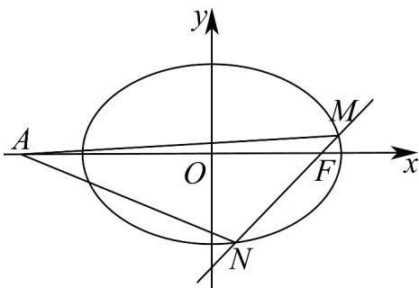

> [!faq]- 《专题10_椭圆标准方程及其性质高频题型精准突破_九大题型__高效培优期》官方解析
>
> > [!success]- **【答案】** (1) $\frac{x^{2}}{4}+\frac{y^{2}}{2}=1$ (2) (i) 直线 $l$ 恒过定点 $M\left(-\frac{1}{2}, 0\right)$ ; (ii) $\left(0, \frac{5}{8} \sqrt{30}\right)$
>
> > [!note]- **【分析】**
> > （1）利用题意并结合正弦定理建立方程，求解基本量，进而得到椭圆方程即可·
> >
> > (2) (i) 作出符合题意的图形，结合万能公式将所有斜率用 $t_1, t_2$ 进行表示，得到 $t_1t_2 = -\frac{5}{3}$ ，再求出 $PQ$ 的斜率，进而得到 $PQ$ 的方程，最后求解定点，(ii) 利用三角形面积公式表示出 $S_{\triangle BPQ}$ ，再构造基本不等式求解取值范围即可.
>
> > [!note]- **【解析】**
> > （1）因为长轴长是短轴长的 $\sqrt{2}$ 倍，所以 $2a = 2b\cdot \sqrt{2}$
> >
> > 即 $a = \sqrt{2} b$ ，又 $a^2 = b^2 + c^2$ ，得到 $b^2 = c^2$ ，即 $b = c$
> >
> > 如图，作出符合题意的图形，
> >
> > 
> >
> > 而 $b = c$ ，则 $\angle ADB = 45^{\circ}$ ，故 $\angle AFD = 135^{\circ}$
> >
> > 由勾股定理得 $\left|AD\right| = \sqrt{3}b$ ，而 $\triangle ADF$ 外接圆的半径为 $\sqrt{3}$
> >
> > 由正弦定理得 $\frac{\sqrt{3}b}{\frac{\sqrt{2}}{2}} = 2\sqrt{3}$ ，解得 $b = \sqrt{2}$ ，所以 $a = 2$
> >
> > 故椭圆的方程为 $\frac{x^2}{4} +\frac{y^2}{2} = 1$
> >
> > (2) (i) 如图，作出符合题意的图形，
> >
> > 
> >
> > 由条件可知，直线 $l$ 的斜率不为0，设 $P\left(2\cos \theta_1,\sqrt{2}\sin \theta_1\right)$ ， $Q\left(2\cos \theta_{2},\sqrt{2}\sin \theta_{2}\right)$
> >
> > 而 $A(-2,0), B(2,0)$ ，设 $t_1 = \tan \frac{\theta_1}{2}$ ， $t_2 = \tan \frac{\theta_2}{2}$ ，且 $t_1 + t_2 \neq 0$ ，
> >
> > 结合万能公式得 $\sin\theta=\frac{2t}{1+t^{2}},\cos\theta=\frac{1-t^{2}}{1+t^{2}}$
> >
> > $$
> > k _ {1} = \frac {\sqrt {2} \sin \theta_ {1}}{2 \cos \theta_ {1} + 2} = \frac {\sqrt {2} \times \frac {2 t _ {1}}{1 + t _ {1} ^ {2}}}{2 \times \frac {1 - t _ {1} ^ {2}}{1 + t _ {1} ^ {2}} + 2} = \frac {\frac {2 \sqrt {2} t _ {1}}{1 + t _ {1} ^ {2}}}{\frac {4}{1 + t _ {1} ^ {2}}} = \frac {\sqrt {2} t _ {1}}{2} = \frac {t _ {1}}{\sqrt {2}}
> > $$
> >
> > 同理可得 $k_{2} = -\frac{1}{\sqrt{2}t_{1}}$ ， $k_{3} = -\frac{1}{\sqrt{2}t_{2}}$ ， $k_{4} = \frac{t_{2}}{\sqrt{2}}$
> >
> > 由于 $3(k_{1} + k_{4}) = 5(k_{2} + k_{3})$ ，故 $3(t_{1} + t_{2}) = -5\left(\frac{1}{t_{1}} + \frac{1}{t_{2}}\right)$
> >
> > 化简得 $3(t_{1} + t_{2}) = -5 \times \frac{t_{1} + t_{2}}{t_{1}t_{2}}$ ，即 $3 = -\frac{5}{t_{1}t_{2}}$ ，解得 $t_{1}t_{2} = -\frac{5}{3}$ ，
> >
> > 则 $P\left(\frac{2(1 - t_1^2)}{1 + t_1^2}, \frac{2\sqrt{2}t_1}{1 + t_1^2}\right)$ ， $Q\left(\frac{2(1 - t_2^2)}{1 + t_2^2}, \frac{2\sqrt{2}t_2}{1 + t_2^2}\right)$ ，
> >
> > 得到 $k_{PQ} = \frac{\frac{2\sqrt{2}t_2}{1 + t_2^2} - \frac{2\sqrt{2}t_1}{1 + t_1^2}}{\frac{2(1 - t_2^2)}{1 + t_2^2} - \frac{2(1 - t_1^2)}{1 + t_1^2}} = -\frac{4\sqrt{2}}{3(t_1 + t_2)}$
> >
> > 则 $PQ$ 的方程为 $y - \frac{2\sqrt{2}t_1}{1 + t_1^2} = -\frac{4\sqrt{2}}{3(t_1 + t_2)}\left[x - \frac{2(1 - t_1^2)}{1 + t_1^2}\right]$
> >
> > 化简得 $\frac{x}{2}\left(1 - t_1t_2\right) + \frac{y}{\sqrt{2}}\left(t_1 + t_2\right) = 1 + t_1t_2$ ，即 $\frac{4}{3} x + \frac{y}{\sqrt{2}}\left(t_1 + t_2\right) = -\frac{2}{3}$
> >
> > 令 $y = 0$ ，解得 $x = -\frac{1}{2}$ ，故直线 $l$ 恒过定点 $M\left(-\frac{1}{2},0\right)$
> >
> > (ii) 由题意得 $S_{\triangle BPQ} = \frac{1}{2} |BN| \cdot |y_{1} - y_{2}|$
> >
> > $$
> > = \frac {1}{2} \times \frac {5}{2} \times \left| \sqrt {2} \sin \theta_ {1} - \sqrt {2} \sin \theta_ {2} \right| = \frac {5 \sqrt {2}}{2} \left| \frac {t _ {1}}{1 + t _ {1} ^ {2}} - \frac {t _ {2}}{1 + t _ {2} ^ {2}} \right|
> > $$
> >
> > $$
> > = \frac {5}{\sqrt {2}} \cdot \left| \frac {\left(t _ {1} - t _ {2}\right) \left(1 - t _ {1} t _ {2}\right)}{\left(1 + t _ {1} ^ {2}\right) \left(1 + t _ {2} ^ {2}\right)} \right| = \frac {2 0 \sqrt {2}}{3} \cdot \left| \frac {\left(t _ {1} - t _ {2}\right)}{\frac {3 4}{9} + t _ {1} ^ {2} + t _ {2} ^ {2}} \right|
> > $$
> >
> > $$
> > = \frac {2 0 \sqrt {2}}{3} \cdot \left| \frac {t _ {1} - t _ {2}}{\frac {4}{9} + \left(t _ {1} - t _ {2}\right) ^ {2}} \right| = \frac {2 0 \sqrt {2}}{3} \cdot \left| \frac {1}{\frac {4}{9 \left(t _ {1} - t _ {2}\right)} + \left(t _ {1} - t _ {2}\right)} \right|
> > $$
> >
> > 而 $\left|t_{1}-t_{2}\right|=\left|t_{1}+\frac{5}{3t_{1}}\right|\quad\frac{2\sqrt{15}}{3}$ ，当且仅当 $t_{1}=\frac{5}{3t_{1}}$ 时取等，
> >
> > 得到 $\frac{4}{9\left(t_1 + \frac{5}{3t_1}\right)} + t_1 + \frac{5}{3t_1} = \frac{32\sqrt{15}}{45}$ ，由题意得 $t_1 \neq -t_2$ ，则取等不成立，
> >
> > 可得 $\frac{20\sqrt{2}}{3}\cdot \left|\frac{1}{\frac{4}{9(t_1 - t_2)} + (t_1 - t_2)}\right| <   \frac{5}{8}\sqrt{30}$ ，即 $S_{\triangle BPQ}\in \left(0,\frac{5}{8}\sqrt{30}\right)$
> >
> > 故VBPQ面积的取值范围为 $\left(0,\frac{5}{8}\sqrt{30}\right)$
> >
> > 52. 椭圆 $C: \frac{x^2}{a^2} + \frac{y^2}{b^2} = 1 (a > b > 0)$ 过点 $P(\sqrt{3}, 1)$ 且离心率为 $\frac{\sqrt{6}}{3}$ ， $F$ 为椭圆的右焦点，过 $F$ 的直线交椭圆 $C$ 于 $M$ ， $N$ 两点，定点 $A(-4, 0)$ .
> >
> > (1)求椭圆 C 的方程；
> >
> > (2)若 $\triangle AMN$ 面积为 $3\sqrt{3}$ ，求直线 $MN$ 的方程
> >
> > 【答案】(1) $\frac{x^{2}}{6}+\frac{y^{2}}{2}=1$
> >
> > (2) $x \pm y - 2 = 0$
> >
> > 【分析】（1）待定系数法求解出 $a^2, b^2$ 的值，则椭圆 $C$ 的方程可知；
> >
> > (2) 设出直线 $MN$ 的方程，联立直线 $MN$ 的方程与椭圆方程得到纵坐标的韦达定理形式，根据
> >
> > $S_{\triangle AMN}=\frac{1}{2}\cdot\left|AF\right|\cdot\left|y_{1}-y_{2}\right|$ ，代入韦达定理求解出参数值，则直线MN的方程可知
> >
> > 【详解】（1）由题意可知 $\left\{ \begin{array}{l} \frac{3}{a^2} + \frac{1}{b^2} = 1 \\ e = \frac{c}{a} = \frac{\sqrt{6}}{3} \\ a^2 = b^2 + c^2 \end{array} \right.$ ，解得 $\left\{ \begin{array}{l} a^2 = 6 \\ b^2 = 2 \end{array} \right.$
> >
> > 所以椭圆 C 的方程为 $\frac{x^{2}}{6} + \frac{y^{2}}{2} = 1$ .
> >
> > (2) 当直线 $MN$ 的斜率为 0 时，显然不符合题意；
> >
> > 因为 $F(2,0)$ ，设 $MN: x = my + 2, M(x_{1}, y_{1}), N(x_{2}, y_{2})$
> >
> > 联立 $\left\{ \begin{array}{l}x = my + 2\\ x^2 +3y^2 = 6 \end{array} \right.$ ，可得 $\left(m^2 +3\right)y^2 +4my - 2 = 0$
> >
> > 则 $\Delta = 16m^2 + 8(m^2 + 3) = 24m^2 + 24 > 0$
> >
> > $$
> > y _ {1} + y _ {2} = - \frac {4 m}{m ^ {2} + 3}, y _ {1} y _ {2} = - \frac {2}{m ^ {2} + 3}
> > $$
> >
> > 因为 $S_{\triangle AMN} = \frac{1}{2}\cdot |AF|\cdot |y_1 - y_2| = 3\sqrt{(y_1 + y_2)^2 - 4y_1y_2}$
> >
> > 所以 $S_{\triangle AMN} = 3\sqrt{\left(-\frac{4m}{m^2 + 3}\right)^2 - 4\left(-\frac{2}{m^2 + 3}\right)} = \frac{6\sqrt{6}\sqrt{m^2 + 1}}{m^2 + 3} = 3\sqrt{3}$ ，解得 $m = \pm 1$
> >
> > 所以直线 MN 的方程 $x \pm y - 2 = 0$ .
> >
> > 
