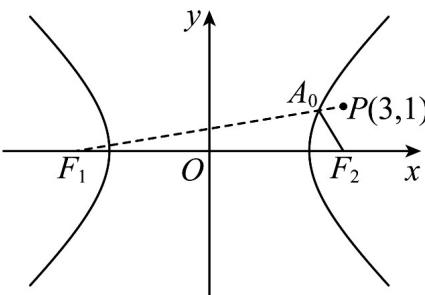

> [!faq]- 《专题11_双曲线标准方程及其性质高频题型精准突破_十大题型__高效培优》官方解析
>
> > [!success]- **【答案】** C
>
> > [!note]- **【分析】**
> > 利用双曲线的定义可得，求 $\left|AP\right|+\left|AF_{2}\right|$ 的最小值相当于求 $\left|AP\right|+\left|AF_{1}\right|-2\sqrt{5}$ 的最小值，当P,A, $F_{1}$ 三点共线时能取得最小值.
>
> > [!note]- **【解析】**
> > 因为 $\left|AP\right|+\left|AF_{2}\right|=\left|AP\right|+\left|AF_{1}\right|-2\sqrt{5}$ ，所以要求 $\left|AP\right|+\left|AF_{2}\right|$ 的最小值，
> >
> > 只需求 $\left|AP\right|+\left|AF_{1}\right|$ 的最小值.
> >
> > 如图,连接 $F_{1}P$ 交双曲线的右支于点 $A_{0}$ ·当点A位于点 $A_{0}$ 处时，
> >
> > $\left|AP\right| + \left|AF_{1}\right|$ 最小，最小值为 $\left|PF_{1}\right| = \sqrt{\left[3 - (-3)\right]^{2} + 1^{2}} = \sqrt{37}$
> >
> > 故 $\left|AP\right|+\left|AF_{2}\right|$ 的最小值为 $\sqrt{37}-2\sqrt{5}$ .
> >
> > 
> >
> > 故选 **C**
