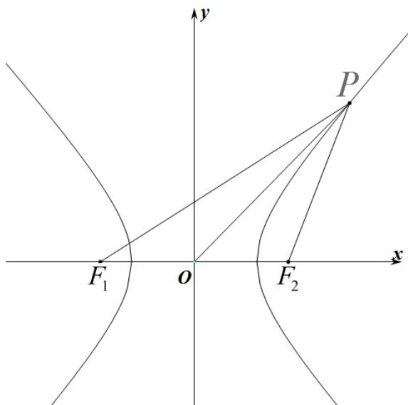

> [!faq]- 《专题11_双曲线标准方程及其性质高频题型精准突破_十大题型__高效培优》官方解析
>
> > [!success]- **【答案】** A
>
> > [!note]- **【分析】**
> > 结合双曲线的定义和余弦定理得 $\left|PF_{1}\right|^{2}+\left|PF_{2}\right|^{2}=40$ ，在 $\triangle POF_{1}$ 和 $\triangle POF_{2}$ 中，由余弦定理得 $(2\left|OP\right|)^{2}+\left|F_{1}F_{2}\right|^{2}=2\left(\left|PF_{1}\right|^{2}+\left|PF_{2}\right|^{2}\right)=80$ ，求解即可.
>
> > [!note]- **【解析】**
> > 由题意得 $\left|F_{1}F_{2}\right|=6$ ， $\left\|PF_{1}\right|-\left|PF_{2}\right\|=2a=4$ ，所以 $\left|PF_{1}\right|^{2}+\left|PF_{2}\right|^{2}-2\left|PF_{1}\right|\left|PF_{2}\right|=16$ ①，
> >
> > 在 $\Delta F_{1}PF_{2}$ 中，由余弦定理得 $\left|PF_1\right|^2 +\left|PF_2\right|^2 -2\left|PF_1\right|\left|PF_2\right|\cos \angle F_1PF_2 = \left|F_1F_2\right|^2$
> >
> > 即 $\left|PF_1\right|^2 +\left|PF_2\right|^2 -\frac{1}{3}\left|PF_1\right|\left|PF_2\right| = 36$ ②，联立①②，解得 $\left|PF_1\right|^2 +\left|PF_2\right|^2 = 40$
> >
> > 因为 $\cos \angle POF_{1} + \cos \angle POF_{2} = 0$
> >
> > 所以在 $\triangle POF_{1}$ 和 $\triangle POF_{2}$ 中，由余弦定理，得 $\frac{|OP|^2 + |OF_1|^2 - |PF_1|^2}{2|OP||OF_1|} + \frac{|OP|^2 + |OF_2|^2 - |PF_2|^2}{2|OP||OF_2|} = 0$
> >
> > 结合 $\left|F_{1}F_{2}\right|=2\left|OF_{1}\right|=2\left|OF_{2}\right|$ ，可得 $\frac{2\left|OP\right|^{2}+2\left|OF_{1}\right|^{2}-\left(\left|PF_{1}\right|^{2}+\left|PF_{2}\right|^{2}\right)}{2\left|OP\right|\left|OF_{1}\right|}=0$ ，
> >
> > 所以 $2\left|OP\right|^2 + 2\left|OF_1\right|^2 - \left(\left|PF_1\right|^2 + \left|PF_2\right|^2\right) = 0$
> >
> > 所以 $4\left|OP\right|^2 + 4\left|OF_1\right|^2 = 2\left(\left|PF_1\right|^2 + \left|PF_2\right|^2\right) = 80$
> >
> > 所以 $4\left|OP\right|^2 +(2\left|OF_1\right|^2 = 80$ ，得 $4\left|OP\right|^2 +(F_1F_2|^2 = 80$
> >
> > 所以 $4|OP|^2 + 36 = 80$
> >
> > 所以 $\left|OP\right|^{2}=11$ ，解得 $\left|OP\right|=\sqrt{11}$
> >
> > 故选：A
> >
> > 
