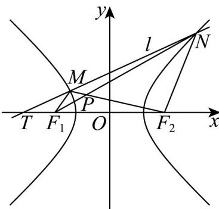

> [!faq]- 《专题11_双曲线标准方程及其性质高频题型精准突破_十大题型__高效培优》官方解析
>
> > [!success]- **【答案】** $\frac{4\sqrt{2}}{3}/\frac{4}{3}\sqrt{2}$
>
> > [!note]- **【分析】**
> > 根据 $\triangle TF_{1}M\sim \triangle TF_{2}N$ ， $\triangle PF_1M\sim \triangle PNF_2$ 得 $\frac{|TF_1|}{|TF_2|} = \frac{1}{5} = \frac{|MF_1|}{|NF_2|} = \frac{|MP|}{|PF_2|} = \frac{|PF_1|}{|PN|}$ ，设 $|MF_1| = t$ ，则 $|NF_2| = 5t$
> >
> > 利用双曲线定义得 $\left|MF_{2}\right|=2\sqrt{2}+t,\left|NF_{1}\right|=2\sqrt{2}+5t$ ，再利用
> >
> > $\left|MF_{2}\right| = \left|MP\right| + \left|PF_{2}\right| = 2\sqrt{2} +t,\left|NF_{1}\right| = \left|PF_{1}\right| + \left|NP\right| = 2\sqrt{2} +5t$ 求出 $\left|PF_2\right|,\left|PF_1\right|$ 可得答案
>
> > [!note]- **【解析】**
> > 由已知得 $a^2 = b^2 = 2, c^2 = 4$ ，所以 $a = b = \sqrt{2}, c = 2$ ， $F_1(-2,0), F_2(2,0)$
> >
> > 因为 $F_{1}M // F_{2}N$ ，所以 $\triangle TF_{1}M \sim \triangle TF_{2}N$ ， $\triangle PF_{1}M \sim \triangle PNF_{2}$
> >
> > 因为 $\left|TF_{1}\right|=3-2=1,\left|TF_{2}\right|=3+2=5$ ，所以 $\frac{\left|TF_{1}\right|}{\left|TF_{2}\right|}=\frac{1}{5}=\frac{\left|MF_{1}\right|}{\left|NF_{2}\right|}=\frac{\left|MP\right|}{\left|PF_{2}\right|}=\frac{\left|PF_{1}\right|}{\left|PN\right|}$ 设 $\left|MF_{1}\right|=t$ ，则 $\left|NF_{2}\right|=5t$ 由 $\left|MF_{2}\right|-\left|MF_{1}\right|=2a,\left|NF_{1}\right|-\left|NF_{2}\right|=2a$ ，得 $\left|MF_{2}\right|=2\sqrt{2}+t,\left|NF_{1}\right|=2\sqrt{2}+5t$ 又 $\left|MF_{2}\right|=\left|MP\right|+\left|PF_{2}\right|=2\sqrt{2}+t,\left|NF_{1}\right|=\left|PF_{1}\right|+\left|NP\right|=2\sqrt{2}+5t$ 所以 $\frac{1}{5}\left|PF_{2}\right|+\left|PF_{2}\right|=2\sqrt{2}+t,\left|PF_{1}\right|+5\left|PF_{1}\right|=2\sqrt{2}+5t$ 可得 $\left|PF_{2}\right|=\frac{10\sqrt{2}+5t}{6},\left|PF_{1}\right|=\frac{2\sqrt{2}+5t}{6}$ 所以 $\left|PF_{2}\right|-\left|PF_{1}\right|=\frac{10\sqrt{2}+5t}{6}-\frac{2\sqrt{2}+5t}{6}=\frac{4\sqrt{2}}{3}$ 故答案为： $\frac{4\sqrt{2}}{3}$
> >
> > 
