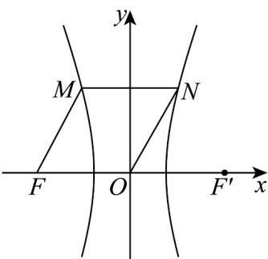

> [!faq]- 《专题11_双曲线标准方程及其性质高频题型精准突破_十大题型__高效培优》官方解析
>
> > [!success]- **【答案】** D
>
> > [!note]- **【分析】**
> > 根据双曲线的定义（或方程）及对称性，结合菱形的性质，可得 $a, c$ 关系，进而得到双曲线的离心率·
>
> > [!note]- **【解析】**
> > 如图，因为四边形 OFMN 为菱形，所以 $MN \left\| OF, \left| MN \right| = \left| MF \right| = \left| ON \right| = \left| OF \right|$ ,
> >
> > 记双曲线的焦距为 $2c$ ，右焦点为 $F'$ ，则 $F(-c,0), F'(c,0)$ ，且根据双曲线的对称性，点 $N$ 的横坐标为 $\frac{c}{2}$ ，
> >
> > 所以 $\cos\angle NOF'=\frac{\frac{c}{2}}{c}=\frac{1}{2}$ ，所以 $\sin\angle NOF'=\frac{\sqrt{3}}{2}$ ，所以点 N 的纵坐标为 $\frac{\sqrt{3}c}{2}$ ，
> >
> > 所以点 $N\left(\frac{c}{2}, \frac{\sqrt{3}c}{2}\right)$ 在双曲线上，代入双曲线方程，得 $\frac{\frac{c^2}{4}}{a^2} - \frac{\frac{3c^2}{4}}{b^2} = 1$
> >
> > 整理得： $\left(-3a^{2}+b^{2}\right)c^{2}=4a^{2}b^{2}$ ，联立 $c^{2}=a^{2}+b^{2}$
> >
> > 得： $\left(-3a^{2} + c^{2} - a^{2}\right)c^{2} = 4a^{2}\left(c^{2} - a^{2}\right)$ ，化简得： $c^4 -8a^2 c^2 +4a^4 = 0$
> >
> > 两边同除以 $a^4$ ，得： $e^4 - 8e^2 + 4 = 0$ ，解得： $e^2 = 4 \pm 2\sqrt{3}, e = \sqrt{3} \pm 1.$
> >
> > 因为双曲线的离心率大于 $1$ ，所以 $e = \sqrt{3} + 1$ .
> >
> > 
> >
> > 方法二：如图，因为四边形 OFMN 为菱形，所以 MN ||OF, |MN| = |MF| = |ON| = |OF|,
> >
> > 记双曲线的焦距为 $2c$ ，右焦点为 $F'$ ，则 $F(-c,0), F'(c,0)$ ，根据双曲线的对称性，点 $N$ 的横坐标为 $\frac{c}{2}$ ，
> >
> > 所以 $\cos\angle NOF'=\frac{\frac{c}{2}}{c}=\frac{1}{2}$ ，所以 $\sin\angle NOF'=\frac{\sqrt{3}}{2}$ ，所以点 N 的纵坐标为 $\frac{\sqrt{3}c}{2}$ ，
> >
> > 所以 $\left|NF\right|=\sqrt{\left(\frac{\sqrt{3}c}{2}\right)^{2}+\left(\frac{3c}{2}\right)^{2}}=\sqrt{3}c$ ，以 $\left|NF'\right|=\sqrt{\left(\frac{\sqrt{3}c}{2}\right)^{2}+\left(\frac{c}{2}\right)^{2}}=c$ 由双曲线的定义，知 $\left|NF\right|-\left|NF'\right|=2a$ ，所以 $\sqrt{3}c-c=2a$ ，所以 $\frac{c}{a}=\frac{2}{\sqrt{3}-1}=\sqrt{3}+1$ ，双曲线C的离心率为 $\sqrt{3}+1$ 。
> >
> > 故选 **D**.
