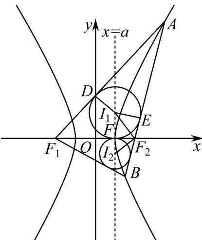

> [!faq]- 《专题11_双曲线标准方程及其性质高频题型精准突破_十大题型__高效培优》官方解析
>
> > [!success]- **【答案】** ACD
>
> > [!note]- **【分析】**
> > 设出直线 $l$ 的方程，与双曲线方程联立，根据题意，两交点的横坐标异号，利用韦达定理即可求解，判断选项A；求出右焦点到渐近线的距离为 $b$ ，进而判断选项B；要使 $\triangle ABM$ 为锐角三角形，则 $\angle AMF_{2} <   45^{\circ}$ ，所以 $c + 4 > \frac{b^2}{a}$ ，进行等量代换求出离心率的取值即可判断选项C；根据三角形内切圆的特点先求出两圆的内心在 $x = a$ 上，然后利用三角形相似求出 $c$ 的值，进而求出 $b$ ，即可判断选项D·
>
> > [!note]- **【解析】**
> > 对于A，由题意知：直线l的斜率存在，设直线l的方程为： $y = k(x + 4)$
> >
> > 设直线 l 与双曲线左右两支的交点分别为 $P(x_{1}, y_{1})$ ， $Q(x_{2}, y_{2})$ ，
> >
> > 联立方程组 $\left\{ \begin{array}{l} \frac{x^2}{4} - \frac{y^2}{b^2} = 1 \\ y = k(x + 4) \end{array} \right.$ ，整理可得： $(b^2 - 4k^2)x^2 - 32k^2x - 64k^2 - 4b^2 = 0$
> >
> > 则 $x_{1} \cdot x_{2} = \frac{-64k^{2} - 4b^{2}}{b^{2} - 4k^{2}} < 0$ ，也即 $b^{2} - 4k^{2} > 0$ ，解得： $-\frac{b}{2} < k < \frac{b}{2}$ ，故选项A正确；
> >
> > 对于 B，设右焦点为 $F_{2}(c,0)$ ，双曲线的渐近线方程为： $bx \pm ay = 0$ ，由点到直线的距离公式可得：点 $F_{2}$ 到双曲线渐近线的距离 $d = \frac{|bc|}{\sqrt{a^{2} + b^{2}}} = b \neq \sqrt{b^{2} + 4}$ ，故选项 B 错误；
> >
> > 对于 C，若直线 AB 垂直于 x 轴，则直线 AB 的方程为：x = c，设点 $A(c, \frac{b^{2}}{a})$ ， $B(c, -\frac{b^{2}}{a})$ ，要使 $\triangle ABM$ 为锐角三角形，由双曲线的对称性可知： $\angle AMF_{2} < 45^{\circ}$ ，
> >
> > 则 $\left|F_{2}M\right|>\left|AF_{2}\right|$ ，即 $c+4>\frac{b^{2}}{a}$ ，所以 $b^{2}<ac+4a$ ，
> >
> > 又因为 $a = 2$ ，则 $b^{2} < ac + 4a = ac + 2a^{2}$ ，也即 $c^2 - a^2 < ac + 2a^2$ ，整理可得： $c^2 - ac - 3a^2 < 0$ ，则 $e^2 - e - 3 < 0$ ，解得： $\frac{1 - \sqrt{13}}{2} < e < \frac{1 + \sqrt{13}}{2}$ ，因为 $e > 1$
> >
> > 所以 $e \in (1, \frac{1 + \sqrt{13}}{2})$ ，故选项 C 正确；
> >
> > 对于D，过 $I_{1}$ 分别作 $AF_{1}, AF_{2}, F_{1}F_{2}$ 的垂线，垂足为D,E,F
> >
> > 
> >
> > 则 $\left|AD\right|=\left|AE\right|,\left|F_{1}D\right|=\left|F_{1}F\right|,\left|F_{2}F\right|=\left|F_{2}E\right|$ ，因为 $\left|AF_{1}\right|-\left|AF_{2}\right|=2a$
> >
> > 则 $\left(\left|AD\right| + \left|DF_1\right|\right) - \left(\left|AE\right| + \left|EF_2\right|\right) = \left|F_1F\right| - \left|F_2F\right| = 2a$ ，又因 $\left|F_1F_2\right| = \left|F_1F\right| + \left|F_2F\right| = 2c$
> >
> > 则 $\left|FF_{1}\right|=\left|OF_{1}\right|+\left|OF\right|=a+c$ ，所以 $\left|OF\right|=a$ ，即 $I_{1}$ 在直线x=a上，同理 $I_{2}$ 也在直线x=a上，所以 $I_{1}I_{2}\perp x$ 轴，
> > 因为 $\angle I_{1}F_{2}A = \angle I_{1}F_{2}F_{1}, \angle I_{2}F_{2}B = \angle I_{2}F_{2}F_{1}$
> >
> > 则 $\angle I_{1}F_{2}A + \angle I_{2}F_{2}B = \angle I_{1}F_{2}F_{1} + \angle I_{2}F_{2}F_{1} = \angle I_{2}F_{2}I_{1}$ ，所以 $\angle I_2F_2I_1 = 90^\circ$
> >
> > 由 $\triangle I_1FF_2\sim \triangle F_2FI_2$ 可知： $\frac{|I_1F|}{|F_2F|} = \frac{|F_2F|}{|I_2F|}$ ，则 $\left|I_2F\right|\cdot \left|I_1F\right| = \left|F_2F\right|^2$ ，也即 $r_1\cdot r_2 = (c - a)^2$
> >
> > 因为 $a = 2$ ， $r_1r_2 = 4$ ，所以 $c = 4$ ， $b = \sqrt{c^2 - a^2} = 2\sqrt{3}$ ，故选项D正确，
