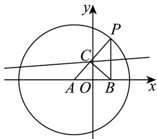
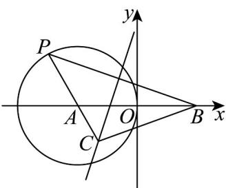

> [!faq]- 《专题11_双曲线标准方程及其性质高频题型精准突破_十大题型__高效培优》官方解析
>
> > [!success]- **【答案】** $\frac{x^2}{9} +\frac{y^2}{5} = 1$ $x^{2} - \frac{y^{2}}{3} = 1$
>
> > [!note]- **【分析】**
> > 利用椭圆和双曲线的定义求解·
>
> > [!note]- **【解析】**
> > 解：如图所示：
> >
> > 
> >
> > 当 $r = 6$ 时， $\left|CA\right| + \left|CB\right| = \left|CA\right| + \left|CP\right| = \left|AP\right| = 6 > \left|AB\right| = 4$
> >
> > 所以点 C 轨迹是以 A，B 为焦点的椭圆，
> >
> > 则 $a = 3$ ， $c = 2, b = \sqrt{5} = \sqrt{a^2 - c^2}$
> >
> > 所以方程为 $\frac{x^{2}}{9}+\frac{y^{2}}{5}=1$ ;
> >
> > 如图所示：
> >
> > 
> >
> > 当 $r = 2$ 时， $\left|\left|CA\right| - \left|CB\right|\right| = \left|\left|CA\right| - \left|CP\right|\right| = \left|AP\right| = 2 <   \left|AB\right| = 4$
> >
> > 所以点 C 轨迹是以 A，B 为焦点的双曲线，
> >
> > 则 $a_1 = 1, c_1 = 2$ ， $b_1 = \sqrt{c_1^2 - a_1^2} = \sqrt{3}$
> >
> > 所以方程为 $x^{2}-\frac{y^{2}}{3}=1$ .
> >
> > 故答案为： $\frac{x^2}{9} +\frac{y^2}{5} = 1$ ， $x^{2} - \frac{y^{2}}{3} = 1$
