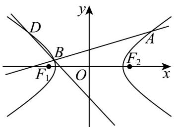

> [!faq]- 《专题11_双曲线标准方程及其性质高频题型精准突破_十大题型__高效培优》官方解析
>
> > [!success]- **【答案】** (1) $\frac{x^{2}}{4}-y^{2}=1$ (2)证明见解析 (3) $\frac{4x^2}{25} - \frac{y^2}{25} = 1(x \neq 0, y \neq 0)$
>
> > [!note]- **【分析】**
> > （1）将点的代入方程，求出 $a, b$ ，即可得双曲线方程；
> >
> > (2) 联立直线与双曲线，结合韦达定理可得直线 BD 方程，即可得证·
> >
> > (3) 由已知可得直线与双曲线相切，可得 $m^2 + 1 - 4k^2 = 0$ ，也可得点 $M$ 与 $ST$ ，进而可得点 $P(x, y)$ 的轨迹方程：
>
> > [!note]- **【解析】**
> > （1）由点 $\left(-\sqrt{5},\frac{1}{2}\right),\left(3,\frac{\sqrt{5}}{2}\right)$ 在双曲线 $C:\frac{x^2}{a^2} -\frac{y^2}{b^2} = 1$
> >
> > 即 $\left\{ \begin{array}{l} \frac{5}{a^2} - \frac{1}{4b^2} = 1 \\ \frac{9}{a^2} - \frac{5}{4b^2} = 1 \end{array} \right.$ ，解得 $\left\{ \begin{array}{l} a^2 = 4 \\ b^2 = 1 \end{array} \right.$
> >
> > 所以双曲线方程为 $\frac{x^2}{4} - y^2 = 1$ ；
> >
> > (2)
> >
> > 
> >
> > 由已知 $l:y = kx + 1(k\neq 0)$ ，设 $A(x_{1},y_{1})$ ， $B(x_{2},y_{2})$
> >
> > 联立直线与双曲线 $\left\{ \begin{array}{l} y = kx + 1 \\ \frac{x^2}{4} - y^2 = 1 \end{array} \right.$ ，得 $\left(1 - 4k^2\right)x^2 - 8kx - 8 = 0$
> >
> > 则 $1 - 4k^{2} \neq 0, \Delta = (-8k)^{2} - 4(1 - 4k^{2}) \cdot (-8) = -64k^{2} + 32 > 0$ ，即 $k^{2} < \frac{1}{2}$ ，且 $k^{2} \neq \frac{1}{4}$
> >
> > $$
> > x _ {1} + x _ {2} = \frac {8 k}{1 - 4 k ^ {2}} \neq 0, x _ {1} x _ {2} = - \frac {8 k}{1 - 4 k ^ {2}}
> > $$
> >
> > 又点 A 与 D 关于 y 轴的对称，
> >
> > 则 $D\left(-x_{1},y_{1}\right)$
> >
> > 所以 $BD: \frac{y - y_{1}}{x + x_{1}} = \frac{y_{2} - y_{1}}{x_{2} + x_{1}}$ ，
> >
> > 即 $\frac{y_2 - y_1}{x_2 + x_1} x = y - y_1 - \frac{x_1(y_2 - y_1)}{x_2 + x_1} = y - \frac{x_2y_1 + x_1y_2}{x_2 + x_1} = y - \frac{2kx_1x_2 + x_1 + x_2}{x_2 + x_1} = y - \frac{\frac{-16k}{1 - 4k^2} + \frac{8k}{1 - 4k^2}}{\frac{8k}{1 - 4k^2}} = y + 1$
> >
> > 即 $BD:y + 1 = \frac{y_2 - y_1}{x_2 + x_1} x$ ，恒过定点 $(0, - 1)$
> >
> > (3) 由已知直线 $l: y = kx + m$ ， $k \neq 0$ ，且 $k \neq \pm \frac{1}{2}$ ，
> >
> > 联立直线与双曲线 $\left\{\begin{aligned}y&=kx+m\\ \frac{x^{2}}{4}-y^{2}&=1\end{aligned}\right.$ ，可得 $\left(1-4k^{2}\right)x^{2}-8kmx-4m^{2}-4=0$
> >
> > 则 $1 - 4k^{2} \neq 0$ ， $\Delta' = (-8km)^{2} - 4(1 - 4k^{2}) \cdot (-4m^{2} - 4) = 16(m^{2} - 4k^{2} + 1) = 0$
> >
> > 即 $m^2 + 1 - 4k^2 = 0$
> >
> > 所以 $x_{M} = \frac{4km}{1 - 4k^{2}} = -\frac{4k}{m}$ ， $km\neq 0$ ，代入直线可得 $y_{M} = k\cdot \left(-\frac{4k}{m}\right) + m = -\frac{1}{m}$
> >
> > 即 $M\left(-\frac{4k}{m}, - \frac{1}{m}\right)$
> >
> > 所以直线 $ST:y + \frac{1}{m} = -\frac{1}{k}\left(x + \frac{4k}{m}\right)$ ，即 $y = -\frac{1}{k} x - \frac{5}{m}$
> >
> > 所以 $S\left(-\frac{5k}{m},0\right)$ ， $T\left(0, - \frac{5}{m}\right)$
> >
> > 即 $\left\{ \begin{array}{l} x = -\frac{5k}{m} \\ y = -\frac{5}{m} \end{array} \right.$ ，可得 $\frac{4x^2}{25} - \frac{y^2}{25} = 1 (x \neq 0, y \neq 0)$ .
