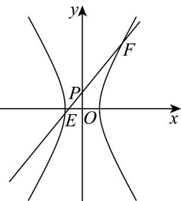
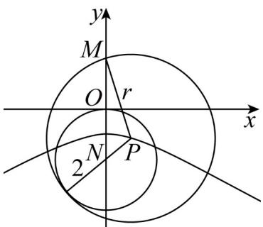

> [!faq]- 《专题11_双曲线标准方程及其性质高频题型精准突破_十大题型__高效培优》官方解析
>
> > [!success]- **【答案】** (1) $x^{2}-\frac{y^{2}}{3}=1(y\neq0)$ (2) $(- \infty, -4) \cup \left(-4, -\frac{4}{3}\right] \cup (20, +\infty)$
>
> > [!note]- **【分析】**
> > （1）设顶点 C 的坐标为 $(x,y)$ ，由 $\overline{MA} + \overline{MB} + \overline{MC} = 0$ ，知 $M\left(\frac{x}{3}, \frac{y}{3}\right)$ 。由 $\left|\overline{NA}\right| = \left|\overline{NB}\right|$ 且向量 $\overline{MN}$ 与 AB 共线，知 N 在边 AB 的中垂线上，由此能求出 VABC 的顶点 C 的轨迹方程。
> >
> > (2) 设 $E(x_{1}, y_{1})$ ， $F(x_{2}, y_{2})$ ，过点 $P(0,1)$ 的直线方程为 $y = kx + 1$ ，代入 $x^{2} - \frac{y^{2}}{3} = 1$ ，得 $(3 - k^{2})x^{2} - 2kx - 4 = 0 (x \neq \pm 1)$ 。再由根的判别式和韦达定理能求出 $PE \cdot PF$ 的取值范围。
>
> > [!note]- **【解析】**
> > （1）设顶点 C 的坐标为 $(x, y)$ ，因为 $\frac{u}{MA} + \frac{u}{MB} + \frac{u}{MC} = 0$ ，∴ $M\left(\frac{x}{3}, \frac{y}{3}\right)$
> >
> > 又 $\left|\overline{NA}\right|=\left|\overline{NB}\right|$ 且向量 $\overline{MN}$ 与 $\overline{AB}$ 共线，
> >
> > $\therefore N$ 在边 $AB$ 的中垂线上， $\therefore N\left(0,\frac{y}{3}\right)$
> >
> > 而 $\left|\overline{NC}\right| = \sqrt{7}\left|\overline{NA}\right|$ ，即 $x^{2} + \left(y - \frac{y}{3}\right)^{2} = 7\left(\frac{1}{7} +\frac{y^{2}}{9}\right),y\neq 0$
> >
> > 化简并整理得顶点 $C$ 的轨迹方程为 $x^{2} - \frac{y^{2}}{3} = 1(y\neq 0)$
> >
> > (2)
> >
> > 
> >
> > 设 $E(x_{1},y_{1})$ ， $F(x_{2},y_{2})$
> >
> > 过点 $P(0,1)$ 的直线方程为 $y = kx + 1$ ，代入 $x^{2} - \frac{y^{2}}{3} = 1$
> >
> > 得 $(3 - k^2)x^2 - 2kx - 4 = 0 (x \neq \pm 1)$ ， $\therefore \Delta = 4k^2 + 16(3 - k^2) > 0$
> >
> > 得 $k^2 < 4 \Rightarrow k \in (-2, 2) (k \neq \pm \sqrt{3}, \pm 1)$
> >
> > 而 $x_{1}, x_{2}$ 是方程的两根，
> >
> > $$
> > \therefore x _ {1} + x _ {2} = \frac {2 k}{3 - k ^ {2}}, x _ {1} x _ {2} = \frac {- 4}{3 - k ^ {2}}
> > $$
> >
> > $$
> > \therefore \stackrel {\mathrm{uuu}} {P E} \cdot \stackrel {\mathrm{uuu}} {P F} = (x _ {1}, y _ {1} - 1) \cdot (x _ {2}, y _ {2} - 1) = x _ {1} x _ {2} + k x _ {1} \cdot k x _ {2} = \frac {- 4 (1 + k ^ {2})}{3 - k ^ {2}}
> > $$
> >
> > 即 $\overline{PE} \cdot \overline{PF} = 4\left(1 + \frac{4}{k^2 - 3}\right) \in (-\infty, -4) \cup \left(-4, -\frac{4}{3}\right) \cup (20, +\infty)$ ，
> >
> > 故 $\frac{\square\square\square}{PE\cdot PF}$ 的取值范围为 $(- \infty, -4) \cup \left(-4, -\frac{4}{3}\right] \cup (20, +\infty)$ .
> >
> > 24. 动圆 $P$ 过定点 $M(0, 2)$ ，且与圆 $N: x^2 + (y + 2)^2 = 4$ 相内切，则动圆圆心 $P$ 的轨迹方程是（）A. $y^2 - \frac{x^2}{3} = 1(y < 0)$ B. $y^2 - \frac{x^2}{3} = 1$ C. $\frac{y^2}{3} - x^2 = 1(y < 0)$ D. $x^2 + \frac{y^2}{3} = 1$
> >
> > 【答案】A
> >
> > 【分析】根据圆与圆的位置关系，结合双曲线的定义得出动圆圆心 $P$ 的轨迹方程·
> >
> > 【详解】圆 $N: x^{2} + (y + 2)^{2} = 4$ 的圆心为 $N(0, -2)$ ，半径为 2，且 $|MN| = 4$ 设动圆 $P$ 的半径为 $r$ ，则 $|PM| = r, |PN| = r - 2$ ，即 $|PM| - |PN| = 2 < |MN|$ 。即点 $P$ 在以 $M, N$ 为焦点，焦距长为 $2c = 4$ ，实轴长为 $2a = 2$ ，虚轴长为 $2b = 2\sqrt{4 - 1} = 2\sqrt{3}$ 的双曲线上，且点 $P$ 在靠近于点 $N$ 这一支上，故动圆圆心 $P$ 的轨迹方程是 $y^{2} - \frac{x^{2}}{3} = 1(y < 0)$
> >
> > 故选：A
> >
> > 
> > 考点 05 有关双曲线渐近线考点
