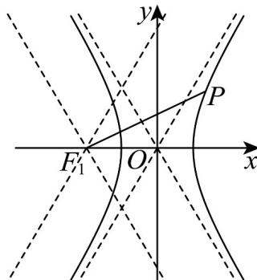
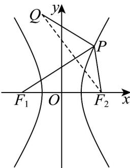

> [!faq]- 《专题11_双曲线标准方程及其性质高频题型精准突破_十大题型__高效培优》官方解析
>
> > [!success]- **【答案】** ACD
>
> > [!note]- **【分析】**
> > 对于 A：根据渐近线的性质分析判断即可；对于 B：分析可知 $\left|F_{1}F_{2}\right|=\left|PF_{1}\right|$ ， $\left|F_{1}F_{2}\right|=\left|PF_{2}\right|$ ，结合双曲线的对称性分析判断；对于 C：设 $P(x_{0},y_{0})$ ，根据点到直线的距离公式结合双曲线的方程运算求解；对于 D：利用双曲线的定义整理可得 $\left|PF_{1}\right|+\left|PQ\right|=\left|PF_{2}\right|+\left|PQ\right|+2$ ，结合图形的性质分析求解即可。
>
> > [!note]- **【解析】**
> > 由双曲线方程可知 $a = 1$ ， $b = \sqrt{3}$ ， $c = \sqrt{a^2 + b^2} = 2$ ，且焦点在 $x$ 轴上，
> >
> > 则 $F_{1}(-2,0), F_{2}(2,0)$ ，渐近线方程为 $y = \pm \sqrt{3} x$
> >
> > 对于选项 $\mathsf{A}$ ：由双曲线的渐近线性质可知：直线 $PF_{1}$ 的斜率 $k\in \left(-\sqrt{3},\sqrt{3}\right)$
> >
> > 
> >
> > 所以 $|k|\in\left[0,\sqrt{3}\right)$ ，故 $^{A}$ 正确；
> >
> > 对于选项 B：因为 $\left|F_{1}F_{2}\right|=4$ ，且 $\left|PF_{1}\right|$ $a+c=3$ ， $\left|PF_{2}\right|=c-a=1$
> >
> > 若 $\Delta PF_{1}F_{2}$ 为等腰三角形，显然 $\left|PF_1\right|\neq \left|PF_2\right|$
> >
> > 当 $\left|F_{1}F_{2}\right|=\left|PF_{1}\right|$ 时，结合对称性可知点P有且仅有2个点；
> >
> > 当 $\left|F_{1}F_{2}\right| = \left|PF_{2}\right|$ 时，结合对称性可知点 $P$ 有且仅有 $^2$ 个点；
> >
> > 综上所述：点 $P$ 有且仅有 ${ }^{4}$ 个点，故 ${ }^{B}$ 错误；
> >
> > 对于选项 C：设 $P(x_{0}, y_{0})$ ，则 $x_{0}^{2} - \frac{y_{0}^{2}}{3} = 1$ ，即 $3x_{0}^{2} - y_{0}^{2} = 3$ ，
> >
> > 则点 $P\left(x_0,y_0\right)$ 到渐近线 $\sqrt{3} x - y = 0$ 、 $\sqrt{3} x + y = 0$ 的距离分别为 $d_{1} = \frac{\left|\sqrt{3}x_{0} - y_{0}\right|}{2}$ 、 $d_{2} = \frac{\left|\sqrt{3}x_{0} + y_{0}\right|}{2}$
> >
> > 所以 $d_{1}d_{2} = \frac{\left|\sqrt{3}x_{0} - y_{0}\right|}{2}\cdot \frac{\left|\sqrt{3}x_{0} + y_{0}\right|}{2} = \frac{\left|3x_{0}^{2} - y_{0}^{2}\right|}{4} = \frac{3}{4}$ ，故C正确；
> >
> > 对于选项D：因为 $\left|PF_1\right| - \left|PF_2\right| = 2$ ，即 $\left|PF_1\right| = \left|PF_2\right| + 2$
> >
> > 则 $\left|PF_{1}\right|+\left|PQ\right|=\left|PF_{2}\right|+\left|PQ\right|+2\quad\left|F_{2}Q\right|+2=7$
> >
> > 当且仅当点 P 在线段 $F_{2}Q$ 上时，等号成立，
> >
> > 
> >
> > 所以 $\left|PF_{1}\right|+\left|PQ\right|$ 最小值为 7，故 D 正确；
> >
> > 故选 **ACD**.
