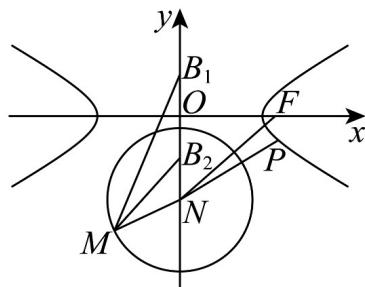
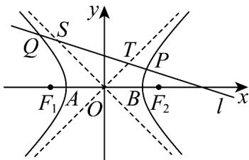

> [!faq]- 《专题11_双曲线标准方程及其性质高频题型精准突破_十大题型__高效培优》官方解析
>
> > [!success]- **【答案】** ABD
>
> > [!note]- **【分析】**
> > 求出双曲线方程及其渐近线方程判断 $^{A}$ ；求出点M的轨迹方程，与双曲线方程联立由解的情况判断 $^{B}$ ；利用圆的性质，结合两点间距离公式求解判断CD.
>
> > [!note]- **【解析】**
> > 设双曲线半焦距为 $c$ ，则 $c = \sqrt{5}$ ，由双曲线 $C$ 经过点 $(\sqrt{5}, \frac{1}{2})$ ，得 $\frac{5}{a^2} - \frac{1}{4b^2} = 1$ ，
> >
> > 而 $a^2 + b^2 = c^2 = 5$ ，解得 $a = 2, b = 1$ ，因此双曲线 $C$ 的方程为 $\frac{x^2}{4} - y^2 = 1$
> >
> > 对于 $\mathsf{A}$ ，双曲线 $C$ 的渐近线方程为 $y = \pm \frac{1}{2} x$ ，即 $x\pm 2y = 0$ ， $\mathsf{A}$ 正确；
> >
> > 对于 $^{B}$ ，由对称性不妨令 $B_{1}(0,1), B_{2}(0,-1)$ ，设 $M(x,y)$ ，由 $|MB_{1}|=\sqrt{3}|MB_{2}|$
> >
> > 得 $\sqrt{x^2 + (y - 1)^2} = \sqrt{3}\cdot \sqrt{x^2 + (y + 1)^2}$ ，整理得 $x^{2} + (y + 2)^{2} = 3$
> >
> > 点 $M$ 的轨迹是以 $N(0, - 2)$ 为圆心，半径为 $\sqrt{3}$ 的圆，由 $\left\{ \begin{array}{l}x^{2} + (y + 2)^{2} = 3\\ x^{2} - 4y^{2} = 4 \end{array} \right.$
> >
> > 消去 x 得 $5y^{2} + 4y + 5 = 0$ ， $\Delta = 16 - 4 \times 5 \times 5 = -84 < 0$ ，因此动点 M 的轨迹与 C 无公共点， $^{B}$ 正确；
> > 对于 $^{C}$ ，点 F 到圆心 N 的距离 $d = \sqrt{(\sqrt{5} - 0)^{2} + (0 + 2)^{2}} = 3$ ，因此 $|FM|$ 的最大值为 $3 + \sqrt{3}$ ， $^{C}$ 错误；
> > 对于 D，设双曲线上任一点 $P(x_{0}, y_{0})$ ，则 $x_{0}^{2}-4y_{0}^{2}=4$ ，P 到圆心 N 的距离为：
> >
> > $$
> > \mid P N \mid = \sqrt {x _ {0} ^ {2} + (y _ {0} + 2) ^ {2}} = \sqrt {4 y _ {0} ^ {2} + 4 + y _ {0} ^ {2} + 4 y _ {0} + 4} = \sqrt {5 (y _ {0} + \frac {2}{5}) ^ {2} + \frac {3 6}{5}} \quad \frac {6 \sqrt {5}}{5}
> > $$
> >
> > 当且仅当 $y_0 = -\frac{2}{5}$ 时取等号，因此 $|PM|$ 的最小值为 $\frac{6\sqrt{5}}{5} - \sqrt{3}$ ，D正确.
> >
> > 故选：ABD
> >
> > 
> >
> > 27．双曲线 $C: x^{2} - y^{2} = 4$ 的左右焦点分别为 $F_{1}$ 、 $F_{2}$ ，左右顶点分别为 A、B，若 P 是右支上一点（与 B 点不重合），如图，过点 P 的直线 l 与双曲线 C 的左支交于点 Q，与其两条渐近线分别交于 S、T 两点，则下列结论中正确的是 \_\_\_\_（写出所有正确的序号）
> >
> > 
> >
> > (1) P 到两条渐近线的距离之积为 2
> >
> > (2) 当直线 l 运动时，始终有 $\left|QS\right|=\left|TP\right|$
> >
> > (3) 在 $\triangle PAB$ 中， $\tan \angle PAB + \tan \angle PBA + 2 \tan \angle APB = 0$
> >
> > (4) $\triangle PF_{1}F_{2}$ 内切圆半径取值范围为 $(0,2)$
> >
> > 【答案】 $(1)(2)(3)(4)$
> >
> > 【分析】（ $^{1}$ ）根据点到直线的距离直接计算可得；
> >
> > (2) 根据线段 ST 与线段 PQ 的中点是否重合可得；
> >
> > (3) 根据直线的倾斜角与三角形内角的关系，再结合三角恒等变换可得；
> >
> > (4) 根据三角形内切圆半径与三角形的面积的关系，将半径表示成关于 $P$ 点的横坐标的一个函数关系，从而求得半径的范围·
> >
> > 【详解】①由双曲线 $C: x^{2} - y^{2} = 4$ ，可化为 $\frac{x^2}{4} - \frac{y^2}{4} = 1$ ，则 $a = b = 2$ ， $c = \sqrt{a^2 + b^2} = 2\sqrt{2}$ ，
> >
> > 双曲线的渐近线方程为 $y = \pm x$ ，即 $x \pm y = 0$ 。
> >
> > 设 $P(x_0, y_0)$ ，因 $P$ 点在双曲线上，所以 $x_0^2 - y_0^2 = 4$
> >
> > 所以 $P$ 到两条渐近线 $x + y = 0$ 和 $x - y = 0$ 的距离分别为：
> >
> > $d_{1}=\frac{\left|x_{0}+y_{0}\right|}{\sqrt{2}}$ ， $d_{2}=\frac{\left|x_{0}-y_{0}\right|}{\sqrt{2}}$ ，所以 $d_{1}d_{2}=\frac{\left|x_{0}+y_{0}\right|}{\sqrt{2}}\times\frac{\left|x_{0}-y_{0}\right|}{\sqrt{2}}=\frac{\left|x_{0}^{2}-y_{0}^{2}\right|}{2}=\frac{4}{2}=2$
> >
> > 故（1）正确；
> > - **②**：由直线 l 与双曲线 C 的左右支都相交，所以直线 l 的斜率存在，
> >
> > 设 l 的方程为 $y = kx + m$ ， $P(x_{1}, y_{1})$ ， $Q(x_{2}, y_{2})$ ， $S(x_{3}, y_{3})$ ， $T(x_{4}, y_{4})$ 。
> >
> > 联立 $\left\{ \begin{array}{l} y = kx + m \\ x^2 - y^2 = 4 \end{array} \right.$ ，消去 $y$ 得 $(1 - k^2)x^2 - 2kmx - m^2 - 4 = 0$ ，
> >
> > 若 $1 - k^2 = 0$ ，即 $k = \pm 1$ ，方程有且仅有一个解，与题意不符·
> >
> > 所以 $k \neq \pm1$ ，且 $x_{1}, x_{2}$ 是方程的两个根，由韦达定理得 $x_{1} + x_{2} = \frac{2km}{1 - k^{2}}$ ，
> >
> > 所以 PQ 的中点的横坐标为 $\frac{x_{1}+x_{2}}{2}=\frac{km}{1-k^{2}}$ .
> >
> > 再联立 $\left\{\begin{aligned}y&=kx+m\\ y&=x\end{aligned}\right.$ ，解得 $x_{4}=\frac{m}{1-k}$ ，再由 $\left\{\begin{aligned}y&=kx+m\\ y&=-x\end{aligned}\right.$ ，解得 $x_{3}=-\frac{m}{1+k}$ .
> >
> > 所以 $ST$ 的中点的横坐标为 $\frac{x_3 + x_4}{2} = \frac{\frac{m}{1 - k} - \frac{m}{1 + k}}{2} = \frac{km}{1 - k^2}$ ，与 $PQ$ 的中点的横坐标相同，且 $P, Q, S, T$ 都在直线 $l$ 上·
> >
> > 所以 ST 与 PQ 的中点重合，根据中点的性质可得 $\left|QS\right|=\left|TP\right|$ .
> >
> > 故 $( ^{2} )$ 正确；
> > - **③**：在 $\triangle PAB$ 中， $A(-2,0)$ ， $B(2,0)$ ，设 $P(x_0,y_0)$ ， $x_0 > 2$ ，则 $x_0^2 - y_0^2 = 4$ 。
> >
> > 因直线 AP 的倾斜角为 $\angle PAB$ ，直线 PB 的倾斜角的补角为 $\angle PBA$ ，且 $\angle PAB + \angle PBA + \angle APB = \pi$ 。
> >
> > 所以 $\tan\angle PAB=\frac{y_{0}}{x_{0}+2}$ ， $\tan\angle PBA=-\frac{y_{0}}{x_{0}-2}$ ，
> >
> > $$
> > \tan \angle A P B = \tan (\pi - \angle P A B - \angle P B A) = - \tan (\angle P A B + \angle P B A)
> > $$
> >
> > $$
> > = - \frac {\tan \angle P A B + \angle P B A}{1 - \tan \angle P A B \tan \angle P B A} = - \frac {\frac {y _ {0}}{x _ {0} + 2} - \frac {y _ {0}}{x _ {0} - 2}}{1 + \frac {y _ {0}}{x _ {0} + 2} \cdot \frac {y _ {0}}{x _ {0} - 2}} = - \frac {\frac {- 4 y _ {0}}{x _ {0} ^ {2} - 4}}{1 + \frac {y _ {0} ^ {2}}{x _ {0} ^ {2} - 4}} = \frac {\frac {4 y _ {0}}{y _ {0} ^ {2}}}{2} = \frac {2}{y _ {0}}.
> > $$
> >
> > $$
> > \tan \angle P A B + \tan \angle P B A + 2 \tan \angle A P B = \frac {y _ {0}}{x _ {0} + 2} - \frac {y _ {0}}{x _ {0} - 2} + 2 \times \frac {2}{y _ {0}} = \frac {- 4 y _ {0}}{x _ {0} ^ {2} - 4} + \frac {4}{y _ {0}} = - \frac {4}{y _ {0}} + \frac {4}{y _ {0}} = 0.
> > $$
> >
> > 故 $^{3}$ 正确；
> > - **④**：设 $\Delta PF_{1}F_{2}$ 内切圆半径为 $r$ ，设 $P(x_0, y_0)$ ， $x_0 > 2$ ，则 $x_0^2 - y_0^2 = 4 \cdot F_1(-2\sqrt{2}, 0), F_2(2\sqrt{2}, 0)$ ，
> >
> > 所以 $\left|PF_{1}\right|=\sqrt{(x_{0}+2\sqrt{2})^{2}+y_{0}^{2}}=\sqrt{(x_{0}+2\sqrt{2})^{2}+x_{0}^{2}-4}=\sqrt{2(x_{0}+\sqrt{2})^{2}}=\sqrt{2}x_{0}+2.$
> >
> > 同理 $\left|PF_2\right| = \sqrt{(x_0 - 2\sqrt{2})^2 + y_0^2} = \sqrt{(x_0 - 2\sqrt{2})^2 + x_0^2 - 4} = \sqrt{2(x_0 - \sqrt{2})^2} = \sqrt{2} x_0 - 2.$
> >
> > 所以 $\left|PF_{1}\right|+\left|PF_{2}\right|+\left|F_{1}F_{2}\right|=(\sqrt{2}x_{0}+2)+(\sqrt{2}x_{0}-2)+4\sqrt{2}=2\sqrt{2}(x_{0}+2)$
> >
> > 由 $S_{\triangle PF_1F_2} = \frac{1}{2} r\big(\big|PF_1\big| + \big|PF_2\big| + \big|F_1F_2\big|\big)$ ， $S_{\triangle PF_1F_2} = \frac{1}{2}\big|F_1F_2\big|\big|y_P\big| = 2\sqrt{2}\big|y_P\big|$
> >
> > 所以 $r=\frac{2S_{\triangle PF_{1}F_{2}}}{\left|PF_{1}\right|+\left|PF_{2}\right|+\left|F_{1}F_{2}\right|}=\frac{4\sqrt{2}\left|y_{P}\right|}{2\sqrt{2}(x_{0}+2)}=\frac{2\sqrt{x_{0}^{2}-4}}{x_{0}+2}=2\sqrt{\frac{x_{0}-2}{x_{0}+2}}=2\sqrt{1-\frac{4}{x_{0}+2}}$
> >
> > 因 $x_0 > 2$ ，所以 $x_0 + 2 > 4$ ，得 $0 < \frac{4}{x_0 + 2} < 1$ ， $0 < \sqrt{1 - \frac{4}{x_0 + 2}} < 1$
> >
> > 所以 $r = 2\sqrt{1 - \frac{4}{x_0 + 2}}\in (0,2)$ 所以 $\triangle PF_{1}F_{2}$ 内切圆半径取值范围为 $(0,2)$
> >
> > 故 $( ^{4} )$ 正确·
> >
> > 故答案为： $(1)(2)(3)(4)$
