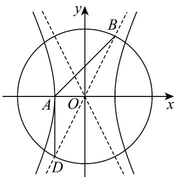

> [!faq]- 《专题11_双曲线标准方程及其性质高频题型精准突破_十大题型__高效培优》官方解析
>
> > [!success]- **【答案】** C
>
> > [!note]- **【分析】**
> > 根据已知，可设 $A(-a,0)$ ， $B(a,b)$ ， $D(-a,-b)$ ，结合已知夹角及向量夹角的坐标表示列方程得 $\frac{b^2}{a^2} = 4$ ，进而求离心率·
>
> > [!note]- **【解析】**
> > 由题设 $A(-a,0)$ ，渐近线为 $y = \pm \frac{b}{a} x$ ，联立圆得 $(1 + \frac{b^2}{a^2})x^2 = a^2 + b^2$ ，可得 $x = \pm a$ ，
> >
> > 不妨令 $B(a,b)$ ， $D(-a, - b)$ ，则 $\overline{AB} = (2a,b),\overline{AD} = (0, - b)$ ，又 $\angle BAD = \frac{3\pi}{4}$
> >
> > 所以 $\cos\left\langle\overrightarrow{AB},\overrightarrow{AD}\right\rangle=\frac{\overrightarrow{AB}\cdot\overrightarrow{AD}}{\left|\overrightarrow{AB}\right|\left| \overrightarrow{AD} \right|}=\frac{-b^{2}}{b\sqrt{4a^{2}+b^{2}}}=-\frac{\sqrt{2}}{2}$ ，可得 $\frac{b^{2}}{4a^{2}+b^{2}}=\frac{1}{2}$
> >
> > 所以 $4a^{2} = b^{2}$ ，则 $\frac{b^2}{a^2} = 4$ ，故离心率 $e = \sqrt{1 + \frac{b^2}{a^2}} = \sqrt{5}$
> >
> > 
> >
> > 故选 **C**
