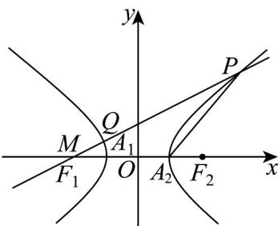
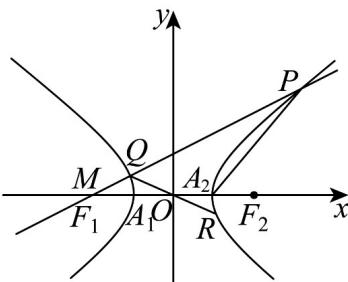

> [!faq]- 《专题11_双曲线标准方程及其性质高频题型精准突破_十大题型__高效培优》官方解析
>
> > [!success]- **【答案】** (1) $P\left(2,2\sqrt{2}\right)$ (2) $\frac{\sqrt{30}}{3}$
>
> > [!note]- **【分析】**
> > （ $^{1}$ ）利用等腰三角形两腰长相等可列方程组求点的坐标；
> >
> > (2) 利用直线与双曲线联立方程组，由韦达定理来表示 $A_{1}R \cdot A_{2}P = 1$ ，利用这个等式可得到 b 与直线参数 m 的函数关系，利用函数求最大值.
>
> > [!note]- **【解析】**
> > （1）
> >
> > 
> >
> > 当 $b = \frac{2\sqrt{6}}{3}$ 时，双曲线 $\Gamma : x^2 - \frac{3y^2}{8} = 1$ ，且 $A_{2}(1,0)$
> >
> > 由点 $P$ 在第一象限，可知 $\angle PA_{2}M$ 为钝角.
> >
> > 由 $\Delta MA_{2}P$ 为等腰三角形，得 $\left|A_2P\right| = \left|A_2M\right| = 3$
> >
> > 设点 $P(x_0,y_0)$ ，且 $x_0 > 0,y_0 > 0$ ，则 $\left\{ \begin{array}{l}x_0^2 -\frac{3y_0^2}{8} = 1\\ \sqrt{(x_0 - 1)^2 + y_0^2} = 3 \end{array} \right.$ ，解得 $\left\{ \begin{array}{l}x_0 = 2\\ y_0 = 2\sqrt{2} \end{array} \right.$
> >
> > 即 $P(2,2\sqrt{2})$ ;
> >
> > (2)
> >
> > 
> >
> > 由双曲线的方程知 $A_{1}(-1,0), A_{2}(1,0)$ ，且由题意知 $Q, R$ 关于原点对称。
> >
> > 设 $P(x_{1},y_{1}),Q(x_{2},y_{2})$ ，则 $R(-x_2, - y_2)$
> >
> > 由直线 PQ 不与 y 轴垂直，可设直线 PQ 的方程为 x = my - 2。
> >
> > 联立 $\left\{\begin{aligned}x&=my-2\\ x^{2}&-\frac{y^{2}}{b^{2}}=1\end{aligned}\right.$ ，得 $\left(b^{2}m^{2}-1\right)y^{2}-4b^{2}my+3b^{2}=0$
> >
> > 则 $b^{2}m^{2} - 1\neq 0$ ，即 $m^2\neq \frac{1}{b^2}$ ， $y_{1} + y_{2} = \frac{4b^{2}m}{b^{2}m^{2} - 1},y_{1}y_{2} = \frac{3b^{2}}{b^{2}m^{2} - 1},$
> >
> > $A_{1}R = (-x_{2} + 1, - y_{2}), A_{2}P = (x_{1} - 1, y_{1}),$
> >
> > 由 $A_{1}R \cdot A_{2}P = 1$ ，得 $(-x_{2} + 1)(x_{1} - 1) - y_{1}y_{2} = 1$ ，
> >
> > 得 $\left(m^2 + 1\right)y_1y_2 - 3m\left(y_1 + y_2\right) + 10 = 0$ ，所以 $\left(m^2 + 1\right) \cdot \frac{3b^2}{b^2m^2 - 1} - 3m \cdot \frac{4b^2m}{b^2m^2 - 1} + 10 = 0$
> >
> > 整理得 $b^{2}m^{2} + 3b^{2} - 10 = 0$ ，则 $b^{2} = \frac{10}{m^{2} + 3}\in \left(0,\frac{10}{3}\right],$
> >
> > 再由 $m^2 \neq \frac{1}{b^2}$ ，得 $b^2 \neq \frac{10}{\frac{1}{b^2} + 3}$ ，解得 $b^2 \neq 3$ ，所以 $b^2 \in (0,3) \cup \left(3, \frac{10}{3}\right]$ ，
> >
> > 又 $b > 0$ ，得 $b\in \left(0,\sqrt{3}\right)\cup \left(\sqrt{3},\frac{\sqrt{30}}{3}\right]$ ，即 $_b$ 的最大值为 $\frac{\sqrt{30}}{3}$
